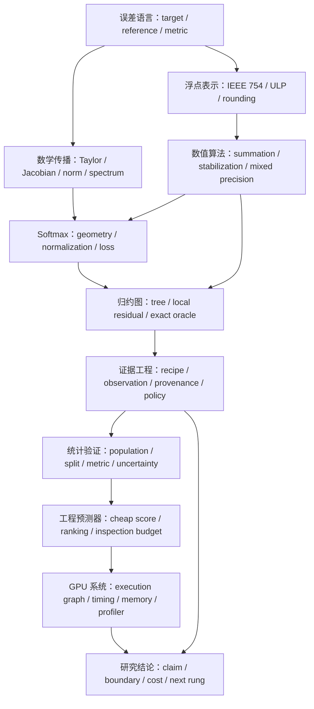
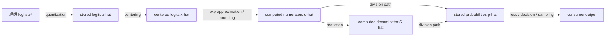
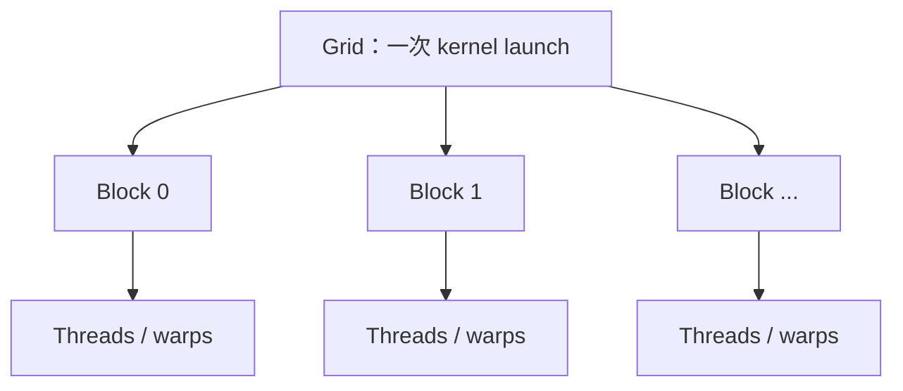
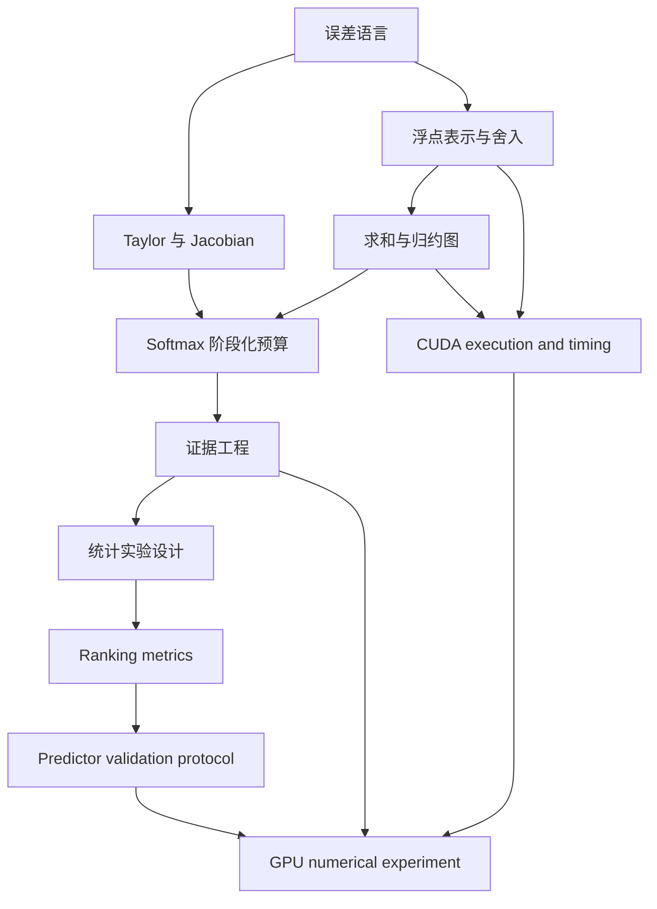

# Error Atlas 完整知识谱

> 从误差语言、浮点算术与 Softmax，到统计预测器验证和 GPU 数值实验的一份离线教材

## 0. 这份教材是什么

Error Atlas 研究的不是某一个孤立公式，而是一条贯穿数学、算法、实现、实验与系统的主线：

$$
\text{我们想得到什么}
\longrightarrow
\text{误差相对于什么定义}
\longrightarrow
\text{误差从哪里进入}
\longrightarrow
\text{经过结构后如何传播}
\longrightarrow
\text{怎样控制}
\longrightarrow
\text{控制需要付出什么成本}.
$$

这份知识谱有四个用途：

1. 作为离线教材，补齐继续推进 Error Atlas 所需的数学、统计和系统知识；
2. 作为地图，说明每个知识点为什么与当前仓库有关；
3. 作为自测材料，通过纸笔练习判断自己是否真正掌握；
4. 作为研究防护栏，区分教材知识、工作假设、数值观察与仓库已接受证据。

它不是实验 artifact，也不新增任何 Softmax 研究结论。仓库当前接受的结论仍以
`NEXT_SESSION.md`、`TOPICS.md`、topic README、实验 README 和版本化 artifacts
为准。

### 0.1 面向的读者

默认读者已经了解：

- Python 基础；
- 微积分和线性代数入门；
- 概率论的均值、方差与条件概率；
- 神经网络中的 logits、Softmax 和 cross-entropy 的基本用法。

不要求读者已经学过数值分析、统计学习或 CUDA。

### 0.2 怎样阅读

有三种读法：

- **主线读法**：按章节顺序阅读，适合建立完整框架；
- **当前任务读法**：直接阅读第 11–15 章，为统计 predictor validation 做准备；
- **GPU 预备读法**：先读第 5–10 章，再读第 16–18 章。

每章包含四类标记：

- **核心概念**：必须能用自己的话解释；
- **仓库连接**：说明它对应 Error Atlas 的哪个对象；
- **常见误区**：最容易导致错误结论的地方；
- **掌握检查**：不看答案也应能完成的问题。

---

## 1. 总知识图



这张图表达两个重要事实。

第一，项目不是“先学完数学，再学完工程”的直线。数学 reference、浮点实现、
实验证据和 consumer decision 会反复相互约束。

第二，越靠后的结论越依赖前面的身份分离。如果 target、reference、metric 或
输入身份没有冻结，再高级的统计量和 profiler 也无法补救含义不清的问题。

---

# 第一部分：误差分析的语言

## 2. 一个误差问题的最小结构

任何误差分析都应从六个问题开始。

### 2.1 Target：到底想得到什么

Target 是任务真正关心的输出。例如：

- $e^x$ 的数值；
- Softmax 概率向量；
- top-1 类别；
- cross-entropy loss；
- 一个 FP32 求和结果是否正确舍入；
- 一个 cheap score 能否把失败 case 排到检查队列前部。

这些 target 不能互换。概率向量有小的 $L_2$ 误差，并不自动保证 top-1 不变；
top-1 不变也不保证 loss 足够准确。

### 2.2 Reference：相对于谁定义误差

Reference 是用来比较的对象。常见 reference 包括：

- 实数算术下的数学函数；
- 对已经存储的 FP32 输入进行精确求值的结果；
- correctly rounded FP32 target；
- 更高精度实现；
- 明确语义的 reduction graph oracle；
- consumer 给出的容差或 decision policy。

最危险的错误之一是把多个 reference 混成“真值”。例如：

$$
\text{source sum}
\ne
\text{stored-input exact sum}
\ne
\text{correctly rounded FP32 sum}
\ne
\text{某个 graph 的实际输出}.
$$

### 2.3 Metric：怎样把差异变成可解释的量

典型 metric 有：

$$
\text{absolute error}=|\widehat y-y|,
$$

$$
\text{relative error}=\frac{|\widehat y-y|}{|y|},
$$

$$
\text{normwise error}=\|\widehat{\mathbf y}-\mathbf y\|,
$$

以及 ULP error、分类错误率、ranking metric、consumer-specific loss 等。

Metric 必须与 consumer 对齐。接近零时相对误差可能爆炸；类别极不平衡时 accuracy
可能掩盖 failure；概率总量等于 $1$ 不能发现类别之间的错误重分配。

### 2.4 Sources：误差从哪些环节进入

建议至少区分：

1. **建模误差**：数学模型与现实对象不一致；
2. **截断或离散化误差**：无限过程被有限近似替代；
3. **输入表示误差**：source value 存入有限 dtype 时发生量化；
4. **舍入误差**：每次算术操作返回邻近可表示数；
5. **迭代误差**：算法在收敛前停止；
6. **近似函数误差**：例如 exp 使用 polynomial approximation；
7. **实现误差**：代码没有实现声明的算法；
8. **测量误差**：timer、profiler、噪声或采样过程改变观察；
9. **统计误差**：有限样本无法完全代表总体。

### 2.5 Propagation：误差经过结构后发生什么

传播可能：

- 放大；
- 衰减；
- 被投影掉；
- 在分量间重新分配；
- 经非线性产生高阶项；
- 经重复运算累积；
- 因 cancellation 暴露先前隐藏的误差；
- 因 rounding graph 不同改变符号和相位。

### 2.6 Control 与 Cost：如何控制，代价是什么

常见控制方法包括：

- 改写公式；
- 提高输入或 accumulator 精度；
- 调整求和顺序；
- 使用补偿算法；
- 缩放、中心化或 range reduction；
- 增加样本和重复次数；
- 使用 exact oracle 复核高风险 case。

但控制永远有成本：运行时间、内存、带宽、实现复杂度、验证成本或精度损失。
因此真正的问题通常不是“怎样让误差最小”，而是：

> 在给定 consumer、容差和预算下，哪种控制最划算？

### 仓库连接

`framework/error_analysis_protocol.md` 的 Error Analysis Card 就是这套结构的研究版。

### 常见误区

- 先选 metric，再想 consumer；
- 用 high precision output 直接当 reference，却没有确认它的适用域；
- 把输入量化误差归因给后续 stable algorithm；
- 只报告 pass/fail，不记录误差大小和方向；
- 把“没有观察到失败”写成“算法保证正确”。

### 掌握检查

1. 对“FP32 Softmax 输出是否可用于 top-1 分类”写一张六项分析卡。
2. 解释为什么 loss reference 与 probability reference 可能要求不同的计算路径。
3. 为一个 timer 偏小的问题指出 target、reference 和 measurement source。

---

## 3. Forward error、backward error 与条件性

### 3.1 Forward error

设数学问题为 $y=f(x)$，算法输出为 $\widehat y$。Forward error 直接比较输出：

$$
\Delta y=\widehat y-f(x).
$$

它回答“答案离目标有多远”。

### 3.2 Backward error

Backward error 寻找一个小扰动 $\Delta x$，使得：

$$
\widehat y=f(x+\Delta x).
$$

它回答“算法是否精确解决了一个邻近问题”。

Backward stable 不等于 forward accurate。如果问题本身病态，一个很小的输入扰动也可能
产生很大的输出变化。

### 3.3 条件性属于问题，稳定性属于算法

条件性描述数学映射 $f$ 对输入扰动的敏感度；稳定性描述具体实现引入了多少额外误差。

局部一阶传播为：

$$
f(x+\Delta x)-f(x)
=J_f(x)\Delta x+O(\|\Delta x\|^2).
$$

因此：

$$
\|\Delta y\|
\lesssim
\|J_f(x)\|\,\|\Delta x\|.
$$

这里 $\|J_f(x)\|$ 是问题在点 $x$ 附近的敏感度，而不是实现的舍入误差界。

### 3.4 混合误差分解

实际系统通常需要：

$$
\underbrace{\widehat f(\widehat x)-f(x)}_{\text{total error}}
=
\underbrace{\widehat f(\widehat x)-f(\widehat x)}_{\text{algorithmic evaluation error}}
+
\underbrace{f(\widehat x)-f(x)}_{\text{input representation propagation}}.
$$

这条分解对 Error Atlas 极其重要：提高后续计算精度只能减小第一项，不能恢复
$x\to\widehat x$ 时已经丢失的信息。

### 常见误区

- 把 Jacobian norm 当成某个浮点程序的稳定性证明；
- 看到 subtract-max 后就断言整个 Softmax 准确；
- 只研究算法内部舍入，却忽略输入在进入算法前已经量化。

### 掌握检查

1. 给出一个 backward error 很小但 forward error 很大的例子。
2. 在上面的 total-error 分解中说明 cast-to-FP32 属于哪一项。
3. 解释为什么固定点 Jacobian 不能自动控制任意大的有限扰动。

---

# 第二部分：数学传播工具

## 4. 线性映射、方向性与谱

### 4.1 误差不仅有长度，还有方向

对线性映射 $A$：

$$
\Delta y=A\Delta x.
$$

若只知道 $\|\Delta x\|$，只能得到最坏情况界：

$$
\|\Delta y\|_2
\le
\|A\|_2\|\Delta x\|_2.
$$

但真实放大率还取决于 $\Delta x$ 的方向。

### 4.2 SVD 的误差解释

令：

$$
A=U\Sigma V^T.
$$

右奇异向量 $v_i$ 是输入方向，左奇异向量 $u_i$ 是输出方向，奇异值
$\sigma_i$ 是对应放大率：

$$
Av_i=\sigma_i u_i.
$$

Operator norm 只保留最大奇异值：

$$
\|A\|_2=\sigma_{\max}.
$$

它适合提供最坏情况上界，但会丢失其余方向结构。

### 4.3 零空间和不敏感方向

若 $Av=0$，沿 $v$ 的扰动被映射完全消去。对 Softmax，共同平移方向
$\mathbf 1$ 就是 Jacobian 的零空间方向。

零空间提醒我们：一个全局的正下界通常不存在。即使某些方向被明显放大，另一些方向
也可能完全不影响输出。

### 4.4 局部界与全局 Lipschitz 界

固定 $x$ 的 $\|J_f(x)\|$ 是局部敏感度。若能在连接 $x$ 与 $x+\Delta x$ 的整个
区域中得到：

$$
\|J_f(z)\|\le L,
$$

则：

$$
\|f(x+\Delta x)-f(x)\|
\le L\|\Delta x\|.
$$

这个 $L$ 才能控制有限扰动。

### 仓库连接

Softmax topic 已经使用共同平移方向、contrast plane、局部谱与全局
$1/2$ operator-norm 界建立了方向性误差语言。

### 掌握检查

1. 手算 $A=\operatorname{diag}(3,0.5)$ 对两个坐标方向的放大率。
2. 解释为什么只报告 $\|A\|_2=3$ 会隐藏重要信息。
3. 构造一个具有零空间的线性映射，并说明它为何没有正的全局下界。

---

## 5. Taylor 展开、remainder 与非线性传播

### 5.1 展开式不是结论，remainder 才决定误差

在 $a$ 附近：

$$
f(a+h)
=
\sum_{k=0}^{n}\frac{f^{(k)}(a)}{k!}h^k
+R_n(h).
$$

多项式部分描述近似，$R_n$ 描述遗漏。只写“高阶项可忽略”不是误差分析，必须回答：

- 在什么区间？
- 需要哪些光滑性？
- remainder 的符号和数量级是什么？
- bound 是否可达到或足够紧？

### 5.2 三种 remainder 语言

**Lagrange remainder** 给出某个中间点 $\xi$：

$$
R_n(h)
=
\frac{f^{(n+1)}(\xi)}{(n+1)!}h^{n+1}.
$$

它适合显式上界，但 $\xi$ 通常未知。

**Integral remainder** 保留路径信息：

$$
R_n(h)
=
\frac{1}{n!}
\int_a^{a+h}f^{(n+1)}(t)(a+h-t)^n\,dt.
$$

**Peano remainder** 强调渐近阶：

$$
R_n(h)=o(h^n),
$$

但通常不给出可直接计算的有限区间常数。

### 5.3 一阶传播的遗漏项

Jacobian 模型：

$$
f(x+\Delta x)
\approx f(x)+J_f(x)\Delta x
$$

本质上是多变量 Taylor 的一阶截断。若扰动不够小，必须审计 remainder。固定 Jacobian
对大扰动失效，并不说明 Jacobian 理论错误，而是说明适用域被跨越。

### 5.4 截断误差与舍入误差的竞争

以中心差分为例：

$$
\frac{f(x+h)-f(x-h)}{2h}
=f'(x)+O(h^2).
$$

减小 $h$ 会降低截断误差，但 subtraction 和除以 $h$ 会放大浮点或测量噪声。典型模型为：

$$
E(h)\approx C_t h^2 + C_r\frac{u}{h}.
$$

因此误差曲线可能存在最优步长，而不是“$h$ 越小越好”。

### 仓库连接

Taylor topic 的第一轮已经覆盖 remainder、bound tightness、数值微分、Richardson
extrapolation、噪声传播和最优步长。它是后续所有 approximation-error 问题的模板。

### 常见误区

- 把 $O(h^2)$ 当作具体误差数值；
- 有效上界很松，却把它当作实际误差预测；
- 只减小离散化步长，不考虑 cancellation 和 noise amplification；
- 用数值拟合出的阶数替代理论适用条件。

### 掌握检查

1. 比较 Lagrange、integral 和 Peano remainder 分别保留什么信息。
2. 从 $C_t h^2+C_r u/h$ 推导最优 $h$ 的数量级。
3. 解释为什么观察到二阶斜率不是一个全区间误差保证。

---

# 第三部分：浮点算术

## 6. IEEE 754 的核心模型

### 6.1 有限集合中的近似实数

二进制浮点数可概念化为：

$$
x=(-1)^s\times m\times 2^e,
$$

其中 sign、significand 和 exponent 都只能取有限范围。因此绝大多数实数不能被精确表示。

### 6.2 Normal、subnormal、zero 与特殊值

Normal number 使用隐含的最高有效位，提供相对精度近似恒定的主要数值范围。

Subnormal number 位于最小 normal 附近和零之间，用逐渐减小的有效位数换取 gradual
underflow。它让数值不会从最小 normal 突然跳到零。

此外还有：

- 正负零；
- 正负无穷；
- NaN。

特殊值不是普通误差大小问题。例如 NaN 会破坏排序、聚合与比较语义，应先作为结构性
故障处理。

### 6.3 Binade 与间距

区间 $[2^e,2^{e+1})$ 称为一个 binade。在同一 normal binade 中，可表示数间距固定；
跨入下一个 binade 后间距通常翻倍。

这意味着 ULP 是位置相关的：

$$
\operatorname{ulp}(x)
\text{ depends on the magnitude and boundary location of }x.
$$

### 6.4 Round-to-nearest, ties-to-even

默认舍入模式选择最近的可表示数；若 exact result 位于两个候选的正中点，则选择最低位为偶数的候选。

Ties-to-even 的目标不是让每次舍入都“向偶数更准确”，而是在大量无偏情形中避免所有 tie
系统性地向同一方向移动。

### 6.5 Machine epsilon 与 unit roundoff

不同资料对符号定义可能不同。常见约定中：

- machine epsilon 是 $1$ 与下一个大于 $1$ 的可表示数之间的间距；
- unit roundoff $u$ 是 round-to-nearest 标准模型中的最大相对舍入量，通常为前者一半。

使用公式前必须写清楚采用的定义，而不是只写 `eps`。

### 6.6 ULP error

ULP error 尝试用目标附近的可表示间距归一化绝对误差：

$$
E_{\mathrm{ULP}}
=
\frac{|\widehat y-y|}{\operatorname{ulp}_{\mathrm{local}}(y)}.
$$

它适合衡量正确舍入距离，但在以下位置要明确约定：

- 零附近；
- subnormal 区域；
- binade 接缝；
- reference 恰在 midpoint；
- reference 不可表示时采用哪一侧的 local spacing。

### 常见误区

- 认为 FP32 只有“小数点后约七位”，忽略尺度和 binade；
- 把 machine epsilon 当作任意运算的绝对误差上界；
- 认为 cast 后再 subtract-max 可以恢复 cast 前的 logit difference；
- 把 subnormal 与 NaN/Inf 混成同一类异常。

### 掌握检查

1. 解释为什么 $2^{24}+1$ 在 FP32 中不能与 $2^{24}$ 区分。
2. 画出 $1$ 附近连续几个 FP32 数及两个 midpoint。
3. 解释 binade carry 为什么是 exact rounding 实现的边界测试。

---

## 7. 标准舍入模型与误差累计

### 7.1 单次运算模型

在无 overflow/underflow 且结果正常的条件下，常写成：

$$
\operatorname{fl}(a\circ b)
=(a\circ b)(1+\delta),
\qquad |\delta|\le u.
$$

这里 $\circ$ 可表示基本算术操作。条件不能省略；在 cancellation、subnormal 或 exact result
为零附近，相对误差形式可能不适用。

### 7.2 多次运算与 $\gamma_n$

若有 $n$ 个小相对误差相乘：

$$
\prod_{i=1}^{n}(1+\delta_i)=1+\theta_n,
$$

在 $nu<1$ 时可用：

$$
|\theta_n|\le\gamma_n
=\frac{nu}{1-nu}.
$$

$\gamma_n\approx nu$ 是一阶尺度，不意味着所有误差总会同号达到该界。

### 7.3 顺序求和

顺序求和：

$$
s_1=x_1,
\qquad
s_k=\operatorname{fl}(s_{k-1}+x_k).
$$

每个早期误差会继续进入后续节点。经典 bound 与 $O(nu)$ 相关，但真实误差强烈依赖：

- 输入顺序；
- 数值符号；
- 动态范围；
- partial sum 所在 binade；
- midpoint 相位。

### 7.4 Pairwise/tree summation

平衡树把路径深度降到 $O(\log n)$，对应常见的 $O(u\log n)$ 量级界。但这只是 bound
结构，不保证每个输入上 pairwise 都比 sequential 准确。

树改变 sibling grouping，也改变每个节点的 exact sum、rounding residual 和后续相位。

### 7.5 Kahan compensation

Kahan summation 维护一个补偿量，尝试回收前一步加法中丢失的低位。核心思想不是“多加一个变量”，
而是把舍入残差显式送回后续计算。

它通常提高准确性，但仍需明确：

- 实际 dtype；
- 编译器是否重排表达式；
- 是否使用 FMA；
- 并行实现是否保持算法 invariant；
- 成本是否适合 consumer。

### 7.6 Exact local residual identity

对一张明确的二叉加法树，节点 $v$ 满足：

$$
a_v=y_{\ell(v)}+y_{r(v)},
\qquad
y_v=\operatorname{RN}(a_v),
\qquad
\rho_v=y_v-a_v.
$$

若树只包含纯加法，根的 signed forward error 可展开为：

$$
E_G
=y_{\mathrm{root}}-\sum_i x_i
=\sum_{v\in G}\rho_v.
$$

这是精确恒等式，不是一阶近似。它说明仅知道 leaf depth 不足以完全确定误差；还需要知道每个
sibling grouping 产生的 exact partial sum 和舍入相位。

### 仓库连接

Softmax 当前 exact graph oracle 正是对 stored FP32 leaves、显式 proper tree 和
RN-even 语义逐节点计算这条恒等式。

### 常见误区

- 把 $O(u\log n)$ 解读为每个输入都更准；
- 把 bitwise repeatable 解读为 numerically correct；
- 看到 predictor 命中 candidate output，就认为 candidate 正确舍入；
- 只记录 graph 的最大深度，不记录 sibling grouping。

### 掌握检查

1. 对四个数画出 sequential 与 balanced 两张树。
2. 为每张树写出所有 $a_v,y_v,\rho_v$。
3. 证明纯加法 proper tree 中每个 $\rho_v$ 以系数 $+1$ 传到根。
4. 解释为什么相同 leaf depths 仍可能产生不同 root bits。

---

## 8. Cancellation、overflow、underflow 与稳定改写

### 8.1 Cancellation

若两个接近的数相减，结果可能很小。减法本身可能正确舍入，但输入中已有的绝对误差相对于小结果
被显著放大。这称为 catastrophic cancellation 的典型机制。

应区分：

- 运算新引入的舍入；
- 输入低位已丢失；
- 小结果造成的相对条件数放大。

### 8.2 Overflow control

直接计算 $e^z$ 可能 overflow。利用恒等式：

$$
\frac{e^{z_i}}{\sum_j e^{z_j}}
=
\frac{e^{z_i-m}}{\sum_j e^{z_j-m}},
\qquad m=\max_jz_j,
$$

可把最大指数移动到 $0$。

这控制的是 exponentiation 阶段的正向 overflow，不会恢复输入存储时已经消失的 contrasts。

### 8.3 Underflow 与 consumer

极小指数可能进入 subnormal 或变为零。若 consumer 只关心概率绝对误差，尾项归零也许可接受；
若 consumer 计算 $-\log p_y$，同一个零可能导致无穷 loss。

所以“是否故障”不能只由数值阶段决定，必须经过：

$$
\text{failure symptom}
\to
\text{consumer}
\to
\text{metric}
\to
\text{tolerance}
\to
\text{decision}.
$$

### 8.4 Stable algebra

数值稳定化常利用数学恒等式在浮点求值前保留抵消。例如 one-hot cross-entropy：

$$
L=(m-z_y)+\log\sum_i e^{z_i-m}.
$$

它比先算 probability 再取 $-\log p_y$ 更能避免 overflow、underflow 和中间信息丢失。

### 8.5 Mixed precision

Mixed precision 至少要拆分：

- input storage dtype；
- arithmetic/compute dtype；
- accumulator dtype；
- output storage dtype；
- 中间 cast 的位置；
- autocast 或 fused kernel 的实际 contract。

“使用 FP32”不是完整描述。FP16 输入、FP32 accumulator、FP16 输出与全 FP32 是不同算法配置。

### 掌握检查

1. 解释为什么稳定公式不能恢复 cast 前已经丢失的差值。
2. 为 tail probability consumer 和 NLL consumer 分别选择 metric。
3. 写出一个需要同时记录四种 dtype 的 reduction 配置。

---

# 第四部分：Softmax 作为误差传播对象

## 9. Softmax 的几何与稳定求值

### 9.1 定义

对 $\mathbf z\in\mathbb R^n$：

$$
p_i
=
\frac{e^{z_i}}{\sum_j e^{z_j}}.
$$

输出满足 $p_i>0$ 且 $\sum_i p_i=1$，位于概率单纯形内部。

### 9.2 Shift invariance

对任意常数 $c$：

$$
s(\mathbf z+c\mathbf 1)=s(\mathbf z).
$$

因此 Softmax 只依赖 logits 之间的 contrasts，而不依赖共同偏移。

### 9.3 Jacobian

$$
J_s
=
\operatorname{diag}(\mathbf p)-\mathbf p\mathbf p^T.
$$

它满足：

$$
J_s\mathbf1=0,
$$

并且：

$$
\mathbf v^TJ_s\mathbf v
=
\operatorname{Var}_{i\sim p}(v_i)
=
\frac12\sum_{i,j}p_ip_j(v_i-v_j)^2.
$$

这给出三个解释：

1. 共同平移被消去；
2. 变化发生在 contrast/tangent directions；
3. 局部敏感度依赖当前概率分布。

### 9.4 条件性和稳定性再次分离

$\|J_s\|$ 控制 exact Softmax 对 logit perturbation 的响应；subtract-max、exp、reduction
和 division 的误差属于具体求值算法。

二者共同决定 total error，但证据不能互相替代。

### 9.5 Fused loss

Softmax 与 cross-entropy 组合后存在解析抵消：

$$
\nabla_{\mathbf z}L=\mathbf p-\mathbf y.
$$

若先物化低精度概率、再取 log 和求导，可能破坏这一稳定结构。Fused implementation 的价值来自
保留代数关系，而不是“fusion”这个标签本身自动保证准确。

### 常见误区

- 用 $\sum_i\widehat p_i=1$ 证明概率准确；
- 认为 subtract-max 解决了所有 Softmax 数值问题；
- 把饱和区的小绝对概率误差当成小 loss error；
- 把 fused kernel 名称当成内部 reduction graph 的证据。

### 掌握检查

1. 推导 $J_s\mathbf1=0$。
2. 解释概率加权方差表示为何保证 Jacobian 半正定。
3. 比较 probability consumer 与 NLL consumer 的 underflow 风险。

---

## 10. Softmax 的阶段化误差预算

### 10.1 计算链



每个阶段的 reference 应冻结前一阶段实际输出，而不是反复回到理想 source。

### 10.2 Exp error

给定 exact centered logits $x_i$：

$$
q_i=e^{x_i},
\qquad
\widehat q_i=q_i(1+\epsilon_i).
$$

若 normalization 精确，令 $\bar\epsilon=\sum_jp_j\epsilon_j$，则：

$$
\frac{\widehat p_i-p_i}{p_i}
=
\frac{\epsilon_i-\bar\epsilon}{1+\bar\epsilon}
\approx
\epsilon_i-\bar\epsilon.
$$

共同 exp 相对误差被 normalization 消去，差异误差则在类别之间重新分配概率。

### 10.3 Sum 与 division error

再加入 denominator 相对误差 $\eta$ 和每个输出的 division error $\delta_i$：

$$
\frac{\widehat p_i-p_i}{p_i}
\approx
\epsilon_i-\bar\epsilon-\eta+\delta_i.
$$

概率总量的一阶偏差为：

$$
\sum_i\widehat p_i-1
\approx
-\eta+\sum_i p_i\delta_i.
$$

它说明 mass residual 主要看见共同 normalization/division 症状，却可能漏掉 exp differential
error 导致的类别间重分配。

### 10.4 输入量化传播

Total error 还需加入：

$$
s(\widehat{\mathbf z})-s(\mathbf z^*).
$$

当 $\mathbf z^*\to\widehat{\mathbf z}$ 已经让 top-two contrast collapse 时，再准确地计算
$s(\widehat{\mathbf z})$ 也只能得到错误输入的准确答案。

### 10.5 Consumer-specific ledger

建议为每个阶段记录：

| Stage | Frozen input | Local reference | Metric | Possible control |
|---|---|---|---|---|
| Input | source logits | stored contrasts | contrast/argmax/loss error | earlier centering or wider storage |
| Exp | stored centered logits | higher-precision exp | classwise or loss error | range reduction, wider exp dtype |
| Sum | stored numerators | exact/high-precision sum | relative error, ULP, repeatability | tree, compensation, wider accumulator |
| Division | actual numerator and denominator | higher-precision quotient | mass + differential metrics | wider division/output dtype |

### 掌握检查

1. 说明哪类误差可以保持 mass 为 $1$ 但改变概率分配。
2. 将一个 observed probability error 分解成 input 与 evaluation 两部分。
3. 为 top-1、NLL 和显式 tail probability 三种 consumer 分别写 metric。

---

# 第五部分：归约图与 exact oracle

## 11. 从“求和方法”走向“执行图”

### 11.1 数学求和没有顺序，浮点求和有

实数加法满足结合律：

$$
(a+b)+c=a+(b+c).
$$

浮点加法通常不满足：

$$
\operatorname{fl}(\operatorname{fl}(a+b)+c)
\ne
\operatorname{fl}(a+\operatorname{fl}(b+c)).
$$

因此“求和这些数”不是完整算法描述。至少还要知道：

- leaf 的顺序和 exact stored bits；
- 每个内部节点连接哪两个 child；
- 每个节点的 compute dtype；
- 每个节点的 rounding mode；
- 是否有 FMA、compensation、atomic 或隐藏的高精度；
- 最终 output cast。

### 11.2 Proper binary addition tree

一张 proper binary tree 具有：

- 每个 leaf 对应一个输入；
- 每个内部节点恰有两个 child；
- 每个内部节点执行一次指定语义的加法；
- 根输出最终结果；
- 不包含未声明的重排或额外操作。

它是算法 contract，不一定是硬件真实执行图。若 library kernel 未公开内部实现，不能仅凭输出吻合
就唯一反推出 graph。

### 11.3 Semantic oracle 与 candidate

**Semantic oracle** 根据声明的 graph 和 rounding contract 计算该算法应该输出什么。

**Candidate** 是待验证的真实实现，例如 NumPy、CUDA kernel 或某个 library reduction。

需要独立记录：

1. oracle predicted bits；
2. candidate actual bits；
3. prediction 是否匹配 observation；
4. correctly rounded target；
5. candidate 是否正确舍入。

其中 3 和 5 回答完全不同的问题。Candidate 与错误算法 contract 一致时，3 可以为真而 5 为假。

### 11.4 Oracle 的适用域

任何 oracle 都必须写出 contract。例如当前 graph oracle 的典型边界包括：

- stored FP32 leaves；
- finite、非负；
- 无 overflow；
- 每个节点恰进行一次 FP32 RN-even 加法；
- proper binary tree；
- 不包含 Kahan state、negative cancellation、FMA 或未知 black-box graph。

扩大适用域需要新定义和新验证，不能靠“代码似乎也能运行”自动获得。

### 11.5 最小 discriminator

验证 graph hypothesis 时，应构造能区分候选图的最小输入。若两个 graph 在普通随机输入上都得到相同 bits，
这些输入对 graph identity 没有信息。

好的 discriminator 通常位于：

- midpoint 附近；
- binade 接缝附近；
- 大 head 与小 tail 的组合；
- 改变 sibling grouping 后 partial sums 跨越不同舍入边界的位置。

但构造 discriminator 后仍应防止过拟合：一个 case 能证伪 graph hypothesis，却不能唯一确认所有未知内部行为。

### 11.6 Proxy counterexample 的教学意义

假设 cheap score 只保留 leaf depth 和 magnitude：

$$
D_G=\sum_i d_i|x_i|.
$$

它可能漏掉 sibling grouping 导致的 exact partial sum 和 rounding phase。若能构造两张具有相同
$D_G$、相同 margin、相同 depths，却具有不同 failure label 的树，就证明该 score 不是完备
certificate。

注意反例的结论边界：

- 它推翻某个 universal claim；
- 它不证明该 score 在总体上毫无 ranking utility；
- 它不提供 AUROC、AP 或 inspection-budget 表现；
- 它不削弱 exact oracle。

### 仓库连接

Softmax P0–P4 建立了 exact graph oracle 的定义、边界测试和小规模 accepted evidence；P5 的
topology challenge 则以 confirmed negative result 推翻 depth-margin baseline 的 universal
ordering。下一步不应继续看过答案后修补同一反例，而应冻结统计验证协议。

### 常见误区

- oracle 和 cheap predictor 使用同一个名称，导致证据角色混淆；
- 用 candidate output 构造 predictor feature，产生 target leakage；
- graph probe 匹配一次，就宣称识别了未知 library graph；
- 反例推翻 universal claim 后，反过来宣称 score 完全无用；
- 在没有源码、profiler 或固定 kernel 证据时推断 GPU occupancy 和 workspace。

### 掌握检查

1. 用自己的话区分 oracle conformance 与 correct rounding。
2. 解释一个反例能推翻什么、不能证明什么。
3. 设计两个 graph，并描述什么样的输入可能区分它们。
4. 列出把当前 oracle 扩展到 negative leaves 需要重新审计的边界。

---

# 第六部分：证据工程

## 12. 从 case recipe 到 assessment

### 12.1 为什么“保存一个 CSV”还不够

一个表格若没有说明输入怎样生成、候选实现是什么、reference 怎样计算、运行环境是什么，就无法可靠复现。

证据链应拆成：

$$
\text{case recipe}
\to
\text{materialized input}
\to
\text{raw observation}
\to
\text{policy-free summary}
\to
\text{consumer policy}
\to
\text{assessment}.
$$

### 12.2 Case recipe

Case recipe 描述怎样生成输入，而不是只保存一个人类可读名称。常见字段包括：

- generator name 和 version；
- 参数；
- dtype、shape、layout；
- seed；
- graph identity；
- source-value 表示方法；
- 预期适用域。

Recipe 应能 canonical serialize，从而生成稳定 `case_id`。

### 12.3 Materialized input

相同 recipe 实现可能因版本或 bug 产生不同 bytes。因此应对实际进入 candidate 的 ordered bytes
单独 hash。

Recipe identity 回答“声称生成了什么”，input hash 回答“实际运行了什么”。

### 12.4 Raw observation

Raw observation 应尽量靠近事实：

- output value 和 bits；
- nonfinite status；
- signed/absolute error；
- runtime measurement；
- repetition index；
- candidate/config/environment identity；
- 发生时间。

不要在 raw 层过早写 `pass`，因为 pass 依赖 policy。

### 12.5 Policy-free summary

Summary 聚合 observation，但不加入 consumer tolerance。例如：

- mean/max error；
- unique bit-pattern count；
- ULP spread；
- repeat count；
- nonfinite count；
- empirical quantiles。

同一 summary 可以被多个 consumer policy 重用。

### 12.6 Policy 与 assessment

Policy 记录：

- metric；
- tolerance；
- repeatability requirement；
- failure precedence；
- consumer identity；
- policy version。

Assessment 才将 summary 与 policy 组合成 pass/fail/warning。

例如，一个结果可能：

- 通过 $10^{-6}$ relative tolerance；
- 失败 correct-rounding policy；
- 在重复运行中 bitwise stable；
- 仍然具有 deterministic bias。

这些判断可以同时成立。

### 12.7 Identity 的分层

建议区分：

| Identity | 当什么改变时改变 |
|---|---|
| `case_id` | 输入 recipe、ordered values、shape 或 layout 语义改变 |
| `input_hash` | 实际 materialized bytes 改变 |
| `graph_id` | 运算节点和 edges 改变 |
| `config_id` | dtype、block size、算法或 kernel config 改变 |
| `environment_id` | hardware、driver、runtime、library 环境改变 |
| `policy_id` | metric、tolerance 或 decision rule 改变 |
| `artifact_hash` | 版本化输出 bytes 改变 |

身份分离让跨平台比较具有语义。Windows 与 Linux 的 environment metadata 可以不同，但同一逻辑 case
的 case identity 应保持稳定。

### 掌握检查

1. 解释 recipe hash 与 input hash 为什么不能合并。
2. 同一 kernel 换 GPU 时哪些 identity 应改变？
3. 同一输入换 accumulator dtype 时哪些 identity 应改变？
4. 为什么 consumer tolerance 不应写入 raw observation？

---

## 13. Preregistration、provenance 与 artifact 生命周期

### 13.1 Preregistration 的目标

Preregistration 不是行政手续，而是区分预测与事后解释。运行前至少冻结：

- direction；
- scale；
- boundary；
- failure signature；
- 输入或分布；
- target；
- metric；
- falsifier；
- stopping rule。

运行后不能重写原 preregistration。若理解改变，应新增 interpretation 或 evidence-status 记录。

### 13.2 Provenance

Provenance 回答“这个结果从哪里来”。至少包括：

- source file hashes；
- input hash；
- configuration；
- environment snapshot；
- command；
- artifact schema version；
- parent preregistration hash；
- output artifact hashes。

Metadata 应使用稳定 serialization，拒绝 NaN/Inf 等非标准 JSON 数值，并避免本地绝对路径和 secrets。

### 13.3 Artifact 状态

建议使用明确状态：

- **accepted**：满足当前证据 contract；
- **provisional**：保留观察，但研究台阶尚未完整审计；
- **calibration**：用于检查机制或工具，不用于目标 claim；
- **unexecuted preregistration**：已经冻结，尚未运行；
- **negative result**：预先声明的 claim 被证伪；
- **superseded**：被新版本替代但保留 provenance；
- **historical snapshot**：旧 schema/旧 suite 的历史证据。

### 13.4 Negative result 是一等公民

Negative result 可以：

- 阻止无效路线继续扩张；
- 暴露 proxy 丢失的信息；
- 改善下一个协议；
- 形成更精确的 claim boundary。

但不能通过事后缩小 claim 把失败包装成成功。正确做法是保留原 claim、记录 falsifier、明确哪些较弱问题仍未回答。

### 13.5 不覆盖证据

Artifact-producing runner 应默认：

1. 检查输出目录；
2. 拒绝隐式覆盖；
3. 优先写 scratch；
4. 审核 schema、row count 和 hashes；
5. 只有在明确的替换任务中更新 versioned evidence。

普通 regression test 与版本化 experiment evidence 也不能混为一谈。测试再次执行某个函数，不自动构成经过 preregistration、重复策略和 provenance 管理的新实验。

### 常见误区

- 看结果后修改“预测”；
- 删除不符合预期的 raw rows；
- 更新 interpretation 时覆盖旧 observation；
- 用当前代码重新解释旧 schema 中含义不同的列；
- 把测试通过当成 research conclusion；
- 仅保存图，不保存生成图的表格和配置。

### 掌握检查

1. 为一个未执行 experiment 写四项 prediction record。
2. 区分 provisional evidence 与 negative result。
3. 解释为什么 one-shot runner 应拒绝覆盖。
4. 为旧 artifact snapshot 写一段正确的 evidence boundary。

---

## 14. 测试、实验与证明的边界

### 14.1 Unit test

Unit test 检查实现 contract，例如：

- ties-to-even 的边界；
- schema 拒绝未知字段；
- canonical identity 稳定；
- invalid graph 被拒绝；
- exact oracle 与手算小例一致。

测试通过说明已测试 contract 未被观察到破坏，不说明总体统计表现，也不证明数学 claim。

### 14.2 Property test

Property test 检查更广的 invariant，例如：

- Softmax shift invariance；
- probability mass；
- graph tree connectivity；
- hashes 对字段顺序稳定；
- exact sum identity。

它比固定 example 覆盖更广，但随机 sampling 仍不是穷尽证明。

### 14.3 Numerical experiment

实验用于：

- 验证预测；
- 估计规模或频率；
- 寻找反例；
- 比较 mitigation；
- 评估工程 utility。

实验的结论范围由分布、样本、环境和 metric 决定。

### 14.4 Mathematical proof

证明可以建立适用域内的 universal statement，但必须诚实列出假设。一个关于 nonnegative finite
leaves 的证明不能自动覆盖 negative cancellation、overflow 或未知 graph。

### 14.5 Evidence ladder

从弱到强可粗略写成：

1. 数值观察；
2. 渐近解释；
3. 带假设的显式上界；
4. 精确恒等式；
5. 可达到性、下界或反例。

强证据不是总能替代弱证据。例如精确 oracle 可以给标签，但工程 predictor 的总体 utility 仍需统计实验测量。

### 掌握检查

1. 对“36/36 predictions matched”写出三个不能推出的结论。
2. 说明反例与统计总体评估解决不同问题的原因。
3. 解释为什么 exact identity 仍需要实现测试。

---

# 第七部分：统计 predictor validation

## 15. 从反例问题转向总体问题

### 15.1 Universal claim 与 statistical claim

Universal claim 的形式是：

> 对所有满足条件的 case，score 都正确排序或保证安全。

一个有效反例就能推翻它。

Statistical claim 的形式是：

> 在明确分布中，score 通常能把较大误差或 failure 排到更前面。

它不能由单一反例推翻，也不能由几个成功 case 建立；需要抽样、metric 和不确定性分析。

当前 depth-margin counterexample 已解决第一个问题：它不是 universal certificate。下一步要回答第二个问题：
它是否仍具有足够的工程 screening utility？

### 15.2 为什么要冻结 population

如果没有总体，诸如“准确率 90%”或“AUROC 0.8”都没有稳定含义。总体应说明：

- leaf 数量如何取；
- magnitude/dynamic range 如何取；
- 正负号是否允许；
- stored dtype；
- layout/permutation 如何生成；
- graph family；
- margin 或 midpoint 距离的分布；
- 是否包含重复或对称 case；
- 排除哪些 invalid domain。

总体可以是 synthetic controlled distribution，也可以是真实 attention traces。但两者回答不同问题。

### 15.3 为什么先做 controlled distribution

受控分布的优势是：

- 可以保证 oracle 适用域；
- 可以调节 boundary coverage；
- 可以知道哪些机制被改变；
- 可以构造 negative controls；
- 可以检查 score 对 prevalence 和 scale 的反应；
- provenance 更容易冻结。

真实数据增加外部有效性，却同时引入来源许可、预处理、模型版本、相关性和未知机制。正确顺序通常是：

$$
\text{controlled validity}
\to
\text{distribution stress}
\to
\text{real-data external validity}.
$$

### 15.4 Sample unit

可能的 sample unit 包括：

1. 一个 `(stored input, graph)` pair；
2. 一个 base input 下的所有 graph；
3. 一个 recipe family；
4. 一个真实模型 invocation；
5. 一个重复运行的 summary。

选择不同 unit 会改变独立性假设和有效样本量。

例如，同一个 stored input 在十张 graph 上运行会产生十行，但它们共享 leaf values，不能简单视为十个完全独立样本。

### 15.5 Failure prevalence

定义：

$$
\pi=P(F_G=1).
$$

Prevalence 是分布属性，不只是数据表的一列统计。改变 sampling strategy 可能人为改变 $\pi$。

若实验故意过采样 failure boundary，应同时报告：

- 实验样本 prevalence；
- 目标部署总体的预期 prevalence；
- metric 是否受 prevalence 变化影响；
- 是否做重加权。

### 常见误区

- 从手工挑选的困难 case 推断实际 prevalence；
- 把多个高度相关 graph rows 当作独立大样本；
- 看过 labels 后不断改变生成分布；
- controlled distribution 成功后直接宣称真实 attention utility。

### 掌握检查

1. 为 nonnegative FP32 leaves 写一个最小 controlled population 定义。
2. 说明为什么同一 multiset 的多个 permutation 可能构成一个 group。
3. 区分实验 prevalence 与部署 prevalence。

---

## 16. Target、feature 与 leakage

### 16.1 连续 target

Exact graph oracle 给出 signed error：

$$
E_G=y_{\mathrm{root}}-S_{\mathrm{leaf}}.
$$

连续 target 可以选择：

- signed $E_G$：保留偏差方向；
- $|E_G|$：关注误差幅度；
- relative $|E_G|/|S_{\mathrm{leaf}}|$：适合非零且尺度变化明显的 sum；
- local-ULP normalized error：关注与舍入边界的距离；
- consumer-specific continuous loss。

推荐同时保存 raw signed error，不要只保留归一化 target，否则以后无法审计 score 是否系统性偏向某个方向。

### 16.2 Local-ULP normalization

概念形式为：

$$
T_G
=
\frac{|E_G|}{\operatorname{ulp}_{\mathrm{local}}(S_{\mathrm{leaf}})}.
$$

协议必须冻结：

- ULP 以 exact leaf sum、correctly rounded target 还是 graph output 为中心；
- binade boundary 怎样处理；
- subnormal spacing；
- exact zero；
- midpoint 时的 denominator；
- overflow/invalid cases 是否排除。

如果这些定义留到看数据后选择，metric 本身就发生了 researcher degrees of freedom。

### 16.3 分类 target

Correct-rounding failure 可定义为：

$$
F_G
=
\mathbf1\left[
y_{\mathrm{root}}
\ne
\operatorname{RN}_{32}(S_{\mathrm{leaf}})
\right].
$$

其他 consumer 可能定义不同 label，例如：

$$
F_G^{(\tau)}
=
\mathbf1\left[
\frac{|y_{\mathrm{root}}-S_{\mathrm{leaf}}|}{|S_{\mathrm{leaf}}|}>\tau
\right].
$$

两者不能混成一个 `failure` 字段。应使用独立 policy identity。

### 16.4 Cheap feature

一个工程 predictor feature 应满足：

- candidate 执行前可计算；
- 比 exact oracle 或直接执行/检查更便宜；
- 只使用部署时可获得的信息；
- 不读取 target 或 target 的等价变换；
- 计算 contract 明确；
- cost 可测量。

候选 feature 可能包括：

- leaf count；
- magnitude summaries；
- depth summaries；
- graph-local pair scale ratios；
- boundary margin 的便宜近似；
- dynamic range；
- shape/layout/config metadata。

但 feature 越接近逐节点 exact replay，成本越可能接近 oracle。最终要比较 utility/cost，而不只是 metric。

### 16.5 Target leakage

下列情况可能泄漏：

- 使用 candidate actual output 构造 pre-run score；
- 使用 exact oracle residual 的某种伪装变换作为 cheap feature；
- 同一 base input 的近重复 graph 同时进入开发集和测试集；
- 根据完整数据的 labels 选择 distribution boundary；
- 在 test set 上反复选择 feature、metric 或 threshold；
- 用 artifact 文件名或生成顺序编码 label。

Leakage 会让离线 metric 很高，却无法代表部署表现。

### 16.6 Predictor、ranker 与 calibrated probability

这三种输出也应分开：

- **score/ranker**：只要求顺序有用；
- **binary classifier**：给定 threshold 后输出 decision；
- **probability model**：声称输出 $P(F=1\mid x)$，需要 calibration 验证。

当前下一步首先需要评估 score/ranker，不必提前声称概率含义。

### 掌握检查

1. 解释 signed $E_G$ 与 $|E_G|$ 分别保留和丢失什么。
2. 写出 correct-rounding 与 tolerance 两个不同 label。
3. 判断“先运行 exact oracle，再把节点最大 residual 当 cheap feature”是否泄漏。
4. 说明一个高 AUROC score 为什么仍可能不是概率。

---

## 17. Split 设计与独立性

### 17.1 为什么即使没有训练模型也需要 split

人们常以为只有 machine learning training 才需要 train/test split。但只要我们会：

- 选择 feature；
- 修改 score 公式；
- 选择 normalization；
- 选择 metric；
- 调整 threshold；
- 根据结果增加或删除 case family；

就在进行适应性开发。因此仍需要保留未触碰的 evaluation split。

### 17.2 建议的三层数据角色

**Design/calibration split**

- 用于检查 pipeline 和 metric 实现；
- 允许看 labels；
- 不用于最终 utility claim。

**Development/validation split**

- 用于比较少量预先声明的 candidate scores；
- 允许做有限选择；
- 每次选择都应记录。

**Frozen test split**

- 协议冻结后才打开；
- 用于一次主要结论；
- 看过后不继续调同一 claim。

### 17.3 Grouped split

如果多个 rows 共享基础结构，应按 group 分割。可能的 group key：

- base recipe；
- exact leaf multiset；
- source case family；
- 同一真实 attention invocation；
- 同一 graph template 的参数化变体。

目标是避免“几乎相同的问题”跨 split 泄漏。

### 17.4 Stratification 的边界

Stratification 可帮助各 split 保持 failure prevalence，但需要谨慎：

- 不能破坏 group integrity；
- 不能用 test labels 反复优化 split；
- 稀少 failure 时可能无法同时满足严格 group 和比例要求；
- 应记录算法、seed 和最终 group counts。

### 17.5 Distribution shift

应区分：

- IID-like split：测试同一受控分布内的泛化；
- held-family-out：测试新参数 family；
- held-scale-out：测试新 magnitude/binade；
- held-topology-out：测试新 graph topology；
- real-data transfer：测试 synthetic 到真实输入的迁移。

这些难度不同，不能合并报告一个模糊的“test score”。

### 推荐的当前最小方案

这是教材性建议，不是已经冻结的仓库协议：

1. 先建立 controlled distribution；
2. 以 base input/family 为 group；
3. 冻结 development 与 test group；
4. 先评估同分布 ranking；
5. 再增加一个 held-family 或 held-scale challenge；
6. 真实 attention leaves 作为后续独立数据阶段。

### 掌握检查

1. 为什么同一 leaf multiset 的两个 layout 不宜随意跨 split？
2. 没有可训练参数的手写 score 为什么仍可能过拟合？
3. 比较 IID、held-scale 和 real-data transfer 三种 claim。

---

## 18. Ranking 与分类指标

### 18.1 Metric 必须从使用场景反推

假设 exact oracle 很贵，工程师只能检查风险最高的一小部分 case。真正的问题是：

> Cheap score 是否能在有限检查预算内找到足够多的严重误差或 failure？

因此应同时保留：

- 连续误差排序质量；
- binary failure 排序质量；
- 实际 inspection budget 下的命中能力；
- failure prevalence；
- predictor computation cost。

### 18.2 Spearman rank correlation

对 paired observations $(s_i,t_i)$，先分别转换成 ranks $R(s_i),R(t_i)$，再计算 Pearson
correlation：

$$
\rho_s
=
\operatorname{corr}(R(s),R(t)).
$$

若无 ties，可写成：

$$
\rho_s
=
1-
\frac{6\sum_i d_i^2}{n(n^2-1)},
$$

其中 $d_i$ 是两个 rank 的差。存在 ties 时应使用 average ranks 并直接计算 rank correlation，
不能盲用无 ties 的简式。

Spearman 回答“是否具有单调排序关系”，但不回答：

- failure 是否集中在 top budget；
- score 是否校准；
- absolute error prediction 是否准确；
- rare failures 是否被找到。

应报告：

- 系数与方向；
- sample/group count；
- ties 比例；
- confidence interval 或 permutation result；
- score/target 定义。

### 18.3 ROC-AUC

对 continuous score 和 binary label，ROC 曲线扫描 threshold，比较：

$$
\operatorname{TPR}
=\frac{TP}{TP+FN},
\qquad
\operatorname{FPR}
=\frac{FP}{FP+TN}.
$$

AUROC 有一个有用解释：随机抽一个 positive 和一个 negative，score 将 positive 排在 negative
前面的概率；ties 通常计半分。

优点：

- threshold-free；
- 反映整体 pairwise ranking；
- 对 class prevalence 的直接变化相对不敏感。

局限：

- failure 很稀少时，大量 true negatives 可让 FPR 看起来很小；
- 不直接回答 top-$k$ inspection utility；
- 不表示概率 calibration；
- 当 test 中只有一个 class 时无定义。

### 18.4 Precision–Recall 与 Average Precision

$$
\operatorname{precision}
=\frac{TP}{TP+FP},
\qquad
\operatorname{recall}
=\frac{TP}{TP+FN}.
$$

PR curve 扫描 threshold。Average Precision 常写成：

$$
AP
=
\sum_k(R_k-R_{k-1})P_k.
$$

对随机排序，AP 的基线约等于 positive prevalence。因此 AP 必须与 $\pi$ 一起报告。

注意：`average precision` 与对 PR curve 做梯形积分的结果可能不同。协议必须冻结具体定义，不能把所有值都称为
`PR-AUC`。

### 18.5 Recall@inspection-budget

设总样本数为 $N$，按 score 降序排列。给定预算 $B$：

$$
\operatorname{Recall@B}
=
\frac{\text{top }B\text{ 中的 failures}}
     {\text{全部 failures}}.
$$

同时可报告：

$$
\operatorname{Precision@B}
=
\frac{\text{top }B\text{ 中的 failures}}{B},
$$

以及相对随机检查的 lift：

$$
\operatorname{Lift@B}
=
\frac{\operatorname{Precision@B}}{\pi}.
$$

预算可以是：

- 固定数量，如 top 100；
- 固定比例，如 top 1%；
- 固定 oracle runtime；
- 固定人工审查时间。

最后一种最接近真实成本，但需要额外测量。

### 18.6 一个纸笔例子

八个 case 按 score 从高到低排列，failure labels 为：

| Rank | 1 | 2 | 3 | 4 | 5 | 6 | 7 | 8 |
|---:|---:|---:|---:|---:|---:|---:|---:|---:|
| $F$ | 1 | 0 | 0 | 1 | 0 | 0 | 0 | 0 |

则：

- prevalence $\pi=2/8=0.25$；
- Recall@2 $=1/2$；
- Precision@2 $=1/2$；
- Lift@2 $=0.5/0.25=2$；
- 两个 positive 分别在 rank 1 和 4，AP 为

$$
AP
=
\frac{1}{2}
\left(
\frac11+\frac24
\right)
=0.75.
$$

这个例子说明：同一个 ranking 可以同时有不错的 AP，却在非常小的 budget 下只找到一半 failure。

### 18.7 Metric 组合建议

当前 predictor validation 可考虑冻结：

| Question | Primary quantity |
|---|---|
| score 是否随连续误差单调变化 | Spearman on local-ULP normalized $|E_G|$ |
| score 是否整体区分 failure | AUROC |
| rare failure 排序是否有用 | AP + prevalence |
| 固定审查预算是否有用 | Recall@B / Precision@B / Lift@B |
| score 是否系统性偏向某方向 | signed-error stratified summaries |
| 是否值得部署 | utility gain versus computation cost |

表中只是候选框架。真正实验前仍需由用户冻结 target、metric 和 budget。

### 常见误区

- 只报告 AUROC，不报告 prevalence 和 top-budget 表现；
- 把 AP 与任意梯形 PR-AUC 混用；
- ties 很多时不记录 tie policy；
- score 越小越危险，却忘记统一排序方向；
- 在 test labels 上挑选最漂亮的 budget；
- 用 accuracy 评价极少数 failure 的筛查器。

### 掌握检查

1. 重新计算纸笔例子的 Recall@4、Precision@4 和 Lift@4。
2. 给出 AUROC 高但 Recall@很小预算不理想的直觉场景。
3. 解释为什么 AP 必须与 prevalence 一起报告。
4. Spearman 很高时，binary failure metric 为什么仍可能很差？

---

## 19. 不确定性、样本量与依赖

### 19.1 Label 可以确定，metric 仍有抽样不确定性

Exact oracle 可能确定性地给出每个 sampled case 的 label，但 sampled cases 只是总体的一部分。因此 AUROC、AP、
Spearman 和 Recall@B 仍具有 sampling uncertainty。

### 19.2 Confidence interval

Point estimate 只给一个数；confidence interval 描述在重复抽样意义下估计的不确定程度。

不应机械解释为“真实参数有 95% 概率位于该区间”，而应明确采用的方法和抽样模型。

### 19.3 Bootstrap

普通 nonparametric bootstrap 从现有样本中有放回地重采样，重复计算 metric。

若 rows 具有 group dependence，应重采样 groups，再保留 group 内全部 rows，而不是逐行 bootstrap。否则区间会过窄。

对 rare failures，bootstrap replicate 可能不含 positive 或 negative，导致 AUROC/AP 无定义；协议应预先说明处理规则，而不是静默丢弃不利 replicate。

### 19.4 Permutation test

Permutation test 可检验 score 与 target 无关联的 null hypothesis：

1. 保留 score；
2. 在允许的 exchangeability unit 内打乱 target；
3. 重算 metric；
4. 比较 observed metric 与 permutation distribution。

若存在 groups，应在符合设计的层级置换，不能破坏依赖结构。

Spearman 的渐近 p-value 在小样本时可能不可靠，permutation test 往往更诚实。但 p-value 仍不表示 effect size 或工程 utility。

### 19.5 Rare failure 与有效样本量

总行数很大不等于 failure 信息充足。若 $N=10000$ 但只有 3 个 failures，AP 和 Recall 的不确定性仍可能很大。

应至少报告：

- total samples；
- independent groups；
- positive/negative counts；
- prevalence；
- 各 split 的 counts；
- undefined-metric conditions；
- confidence interval。

### 19.6 Sample-size 思考

正式 power calculation 需要 effect 和分布假设。当前阶段可以先用以下问题约束设计：

- 希望 test 中至少观察多少 failures？
- 最小有意义的 Recall@B 差异是什么？
- CI 宽度多大仍能支持工程决定？
- 每增加一个 sample 的 oracle cost 是多少？
- group sampling 会怎样减少有效样本量？

若 controlled distribution 的自然 failures 太少，可以设计 boundary-focused stratum，但必须将其视为独立 stratum，不能把其 prevalence 冒充自然总体 prevalence。

### 19.7 Multiple comparisons

如果尝试 50 个 scores，只报告最好的一个，即使所有 score 都无效，也容易得到偶然高 metric。

控制方法包括：

- 预先限制 candidate scores；
- 分离 development/test；
- 完整记录尝试；
- 对 exploratory 与 confirmatory results 使用不同标签；
- 必要时调整多重检验，但不要用统计修正替代良好设计。

### 常见误区

- 把行数当作独立样本量；
- 只给 metric，不给 positive count；
- CI 很宽时仍只讨论 point estimate 的排名；
- p-value 小就称为“工程上有用”；
- bootstrap 时打散同一 base case 的 graph rows。

### 掌握检查

1. 为什么 deterministic oracle 不消除抽样不确定性？
2. 设计一个 grouped bootstrap 的伪代码。
3. test 中没有 failure 时哪些 metric 无法回答目标问题？
4. 区分 statistical significance 与 inspection utility。

---

## 20. 一份可冻结的 predictor-validation 协议

下面是后续研究可以使用的完整模板。填写模板本身不等于协议已经被仓库接受；必须在执行前审阅并版本化。

```text
# Predictor Validation Protocol

## Research question
- 想评估的是 continuous error ranking、failure ranking、probability calibration，
  还是 inspection-budget utility？

## Oracle contract
- Stored dtype:
- Allowed values:
- Graph semantics:
- Rounding mode:
- Excluded domain:

## Population
- Case generator and version:
- Parameter distributions:
- Graph families:
- Layout/permutation distribution:
- Boundary strata:
- Intended deployment population:

## Sampling unit and grouping
- Row unit:
- Independent/group unit:
- Group key:
- Duplicate policy:

## Split
- Design/calibration groups:
- Development groups:
- Frozen test groups:
- Split seed and algorithm:
- Stratification rule:
- Held-family/held-scale challenge:

## Targets
- Raw signed target E_G:
- Continuous primary target:
- Local ULP definition:
- Binary label F_G:
- Consumer-policy labels, if any:

## Candidate cheap scores
- Name/version/formula:
- Available before candidate execution:
- Computational cost model:
- Expected direction:
- Known blind spots:

## Primary metric
- Definition:
- Tie handling:
- Score direction:
- Undefined conditions:

## Secondary metrics
- Spearman:
- AUROC:
- AP and prevalence:
- Recall/Precision/Lift at frozen budgets:

## Uncertainty
- Resampling unit:
- Bootstrap/permutation method:
- Replicate count:
- Confidence interval:
- Invalid replicate policy:

## Preregistered prediction
- Direction:
- Scale:
- Boundary:
- Failure signature:

## Falsifier and decision rules
- What result falsifies the strong claim?
- What weaker result still supports limited utility?
- What result is inconclusive?

## Artifacts
- Case table:
- Raw oracle labels:
- Policy-free metric summary:
- Metadata and hashes:
- Plots:

## Stopping rule
- Frozen sample count or precision target:
- No post-test score modification:
```

### 20.1 推荐的实现顺序

1. 用户先用自己的话解释每个 metric；
2. 用 6–10 个纸笔 rows 写 expected values；
3. 用户主写最小 NumPy/Python 实现；
4. 为 ties、全同 score、单一 class、零 budget 写 boundary tests；
5. 再与一个成熟统计库做交叉验证；
6. 冻结协议和 hashes；
7. 生成 controlled cases；
8. 只在最后打开 frozen test；
9. 区分 observation、interpretation 和 decision；
10. 再决定是否进入真实 attention data。

### 20.2 当前不急于做的事

- 训练复杂 machine-learning predictor；
- 引入大量统计依赖；
- 从真实 GPT-2 traces 开始；
- 在看过 test labels 后继续添加 proxy features；
- 把 score 解释成概率；
- 进入 GPU performance comparison。

### 掌握检查

1. 独立填写一份只含一个 cheap score 的最小协议。
2. 标出模板中所有必须在看 test labels 前冻结的字段。
3. 解释为什么“先写 metric 实现，再决定 target”顺序错误。

---

# 第八部分：GPU 数值实验基础

## 21. GPU 执行模型

### 21.1 Host 与 device

典型 CUDA 程序包含：

- CPU host code：准备输入、分配内存、发起 kernel、收集结果；
- GPU device code：大量线程并行执行 kernel；
- host/device memory transfer；
- synchronization 和 timing。

GPU 不是“更快的普通 CPU”。它通过大量轻量线程隐藏延迟，适合规则、数据并行、算术密度较高的工作。

### 21.2 Grid、block、thread

Kernel launch 创建一个 grid；grid 包含 blocks；block 包含 threads。



同一 block 内线程可以通过 shared memory 和 block barrier 协作；不同 block 通常不能在普通 kernel 内执行全局 barrier。

### 21.3 Warp 与 SIMT

Threads 以 warp 为执行批次。SIMT 允许每个 thread 有自己的 state，但同一 warp 中分支分歧会导致执行路径序列化。

对 reduction 来说，warp-level shuffle 可以在 lanes 间交换值，形成明确或部分明确的树形计算。

### 21.4 Streaming multiprocessor 与资源

Blocks 被调度到 SM。一个 block 消耗：

- threads/warps；
- registers；
- shared memory；
- scheduler 和其他硬件资源。

这些资源限制同时驻留的 blocks/warps，形成 occupancy。但 occupancy 是并发潜力指标，不是性能本身；更高 occupancy 不保证更低 latency。

### 21.5 异步 launch

Kernel launch 通常相对于 host 异步：CPU API 返回时，GPU 可能尚未完成，甚至尚未开始执行。

因此：

```text
start CPU timer
launch kernel
stop CPU timer
```

可能主要测到 launch overhead。必须通过合适的 stream/device synchronization 或 CUDA events 测量目标工作。

### 21.6 Stream 与顺序

同一 stream 中操作具有队列顺序；不同 streams 可能并发，也可能因资源不足而不并发。

“API 是异步的”与“硬件实际并发执行”不是同一事实。后者依赖 hardware、resource 和 dependency。

### 常见误区

- 看到 host timer 很小就认为 kernel 很快；
- 把 thread execution order 当作固定；
- 把 warp 理解成独立硬件 core 数量；
- 把 occupancy 当作 throughput 的直接替代；
- 忘记不同 stream 和 default stream 的同步语义。

### 掌握检查

1. 画出一个 grid、两个 blocks 和每个 block 的 warps。
2. 解释为什么 launch 返回不表示结果可读取。
3. 列出 occupancy 高但性能不一定高的两个原因。

---

## 22. GPU memory hierarchy 与 reduction

### 22.1 Registers

每个 thread 的寄存器访问快，但数量有限。寄存器压力过高可能减少同时驻留的 warps，或产生 register spilling。

### 22.2 Shared memory

Shared memory 位于 block 范围内，适合：

- block reduction；
- tile reuse；
- thread 间协作。

它需要同步和 bank-access 审计。Shared memory 用量也会限制 occupancy。

### 22.3 Global memory

Global memory 容量大、延迟高。访问模式影响 memory coalescing 和实际带宽。

对 reduction 而言，常见目标是：

1. 每个 thread 从 global memory 读取若干元素；
2. 在线程内形成 partial sum；
3. warp 内 reduction；
4. block 内合并；
5. 跨 block 合并。

每一步都可能改变 floating-point graph。

### 22.4 Warp reduction

一种概念性模式为：

```text
offset = warp_size / 2
while offset > 0:
    value += shuffle_down(value, offset)
    offset /= 2
```

这形成一张由 lane mapping 决定的树。要建立数值证据，需要记录：

- active lanes；
- warp size；
- shuffle pattern；
- inactive-lane policy；
- accumulator dtype；
- compiler transformation。

### 22.5 Block 与 cross-block reduction

Block 内可以用 shared memory 或 cooperative groups。跨 block 常见方法包括：

- 多 kernel stages；
- atomics；
- cooperative launch；
- library-specific workspace；
- persistent kernel。

它们具有不同 execution graph、synchronization 和 workspace contract。

### 22.6 Atomic order 与 nondeterminism

多个 threads 对同一 accumulator 做 floating-point atomic addition 时，arrival order 可能随调度变化。由于浮点加法不结合，结果 bits 可能跨运行变化。

但要避免两个极端误解：

- nondeterministic 不等于一定不准确；
- deterministic 不等于准确。

正确报告应分开：

- repeatability；
- reference error；
- output bit distribution；
- environment/config identity。

### 22.7 Library reduction 是 black box

若 library 文档没有保证内部 graph，应把它视为 black-box candidate。可以报告：

- input identity；
- output bits；
- error；
- repeatability；
- latency/throughput；
- public algorithm contract。

不能仅凭“看起来像 pairwise”就声称 warp tree、block size、workspace 或 occupancy。

### 22.8 CPU graph replay 的角色

如果 profiler、源码或自写 kernel 能提供明确 graph，可以在 CPU 上按同一 dtype 和 rounding semantics 逐节点 replay。

若 replay 与 GPU output 一致，说明通用舍入图足以解释 observation；若不一致，再调查：

- FTZ/DAZ；
- approximate math；
- FMA contraction；
- hidden precision；
- compiler reassociation；
- graph contract 错误。

### 掌握检查

1. 将 sequential、warp tree、block tree 画成 explicit graph。
2. 解释 atomic order 为什么影响 bits。
3. 给出 deterministic bias 与 nondeterministic spread 的不同 summary。
4. 说明什么证据足以让一个 black-box graph 变成 declared graph candidate。

---

## 23. GPU timing、profiling 与性能证据

### 23.1 Correctness before performance

性能比较前先冻结：

- 输入和 output contract；
- reference 和 tolerance；
- candidate config；
- warm-up policy；
- synchronization；
- timing region；
- repetition count；
- environment。

一个更快但计算不同 target 的 kernel 不构成公平比较。

### 23.2 Warm-up

首次运行可能包含：

- context initialization；
- module/JIT compilation；
- memory allocation；
- autotuning；
- cache population；
- frequency ramp-up。

应将 cold-start 与 steady-state 分开报告，而不是静默丢弃首次数据或混入平均值。

### 23.3 CUDA events 与 synchronization

对于 device execution，CUDA events 可以在 stream 时间线上记录 elapsed time。若使用 host timer，应确保目标操作在停止计时前已经完成。

同步位置会改变测量对象：

- 每次 kernel 后同步：测单次 latency，但阻止 overlap；
- 一批 launches 后同步：更接近 throughput；
- 包含 memory copy：测 end-to-end；
- 不包含 copy：测 device kernel only。

必须写出是哪一种。

### 23.4 Latency 与 throughput

Latency：完成一个工作单元所需时间。

Throughput：单位时间处理多少元素、bytes 或 cases。

小 batch latency 最优的实现，不一定在大 batch throughput 最优。

### 23.5 Distribution 而不是单个最小值

应保存 raw timings，并报告适合的 summaries，例如：

- median；
- p10/p90 或 IQR；
- minimum 作为近似无干扰下界时的明确用途；
- number of repetitions；
- outlier policy。

不要只挑最好的一次，也不要只给 average 而隐藏长尾。

### 23.6 Profiler 能证明什么

Profiler 可以提供：

- kernel launches；
- duration；
- memory traffic；
- achieved occupancy；
- instruction/memory stall 信息；
- grid/block dimensions；
- source-level hotspots（条件允许时）。

但 profiler metric 仍需解释。高 memory bandwidth 可能是好事，也可能说明做了不必要的数据移动；高 occupancy 也可能伴随低 instruction efficiency。

### 23.7 Autotuning 与 identity

如果 framework 根据 shape/hardware 自动选择 kernel 或 block size，实际 config 可能跨运行或跨环境变化。

此时：

- autotuner policy 属于 config；
- 选择出的实际 kernel/block size 也应记录；
- 选择改变时 `config_id` 应改变；
- 不能把不同实际 config 聚合为同一个 candidate。

### 掌握检查

1. 设计 kernel-only latency 与 end-to-end latency 两种 timing protocol。
2. 解释 warm-up 为什么既不能完全忽略，也不能与 steady-state 混报。
3. 同一 kernel 换 GPU 时哪些 metadata 改变？
4. Autotuner 改变 block size 时为什么不能保持同一 config identity？

---

## 24. Error Atlas 的 GPU 迁移阶梯

下面是推荐的教学和实验顺序。它与当前仓库“GPU 暂停”的边界一致；这里只描述未来路线，不表示已经授权执行。

### G0：概念与计时

- 学习 host/device、async launch、stream、event、synchronization；
- 对一个无研究含义的小 kernel 验证 host timer 与 event timer 的区别；
- 不生成 Softmax research artifact。

### G1：execution hierarchy

- 学习 thread/block/warp/grid；
- 学习 registers/shared/global memory；
- 画出 reduction mapping；
- 先不优化。

### G2：自写固定图 reduction

- 使用明确 graph；
- 冻结 block size 和 accumulator dtype；
- 在 CPU exact oracle 中复刻；
- 使用最小 hand-checkable cases；
- 验证 bits 和 signed error。

### G3：repeatability 与 accuracy

- 固定 input hash；
- 重复运行；
- 分开记录 unique bits、spread 和 reference error；
- 不用 repeatability 代替 correctness。

### G4：performance

- 冻结 correctness gate；
- 再比较 latency、throughput、workspace；
- 记录 warm-up、sync 和 environment；
- 不从 CPU prototype timing 推断 GPU 排名。

### G5：library black-box baseline

- 记录 public API contract；
- 报告 output、error、repeatability 和 performance；
- 在缺乏证据时不推断内部 graph；
- 与自写 fixed-graph kernel 分开命名。

### G6：真实 Softmax/attention integration

- 只有在 controlled cases 收口后进入；
- 保留同一 CaseRecipe/input hash/policy 分层；
- 把 model/data provenance 加入 metadata；
- 限制 claim 到实际 hardware、driver、CUDA 和 framework 版本。

### GPU 阶段的停止条件

若以下任一项缺失，应停止扩大 claim：

- target hardware；
- 可复现 input；
- 明确 timing contract；
- reference/oracle；
- graph 或 black-box 边界；
- consumer metric；
- 必要权限或数据来源。

---

# 第九部分：后续理论支线

## 25. Log-sum-exp、Fisher information 与局部 KL

这一章是后续博客和理论扩展的入口，不是当前 predictor validation 的前置条件。

### 25.1 Log-partition function

定义：

$$
A(\mathbf z)
=
\log\sum_i e^{z_i}.
$$

它的梯度就是 Softmax：

$$
\nabla A(\mathbf z)=\mathbf p.
$$

Hessian 为：

$$
\nabla^2 A(\mathbf z)
=
\operatorname{diag}(\mathbf p)-\mathbf p\mathbf p^T
=J_s.
$$

因此 Softmax Jacobian 同时也是 log-partition function 的曲率。

### 25.2 Covariance 解释

若类别 one-hot 随机变量为 $X$，则：

$$
\operatorname{Cov}(X)
=
\operatorname{diag}(\mathbf p)-\mathbf p\mathbf p^T.
$$

这解释了：

- Jacobian 半正定；
- 共同平移方向为零；
- 概率集中后多数方向曲率变小；
- contrast directions 承载可识别变化。

### 25.3 Fisher information

对 categorical exponential family，自然参数存在共同平移冗余。在去除该冗余的参数空间中，Fisher
information 与上述 covariance/Jacobian 结构相连。

要小心：完整 $\mathbf z\in\mathbb R^n$ 参数化不是可识别的，因为
$\mathbf z$ 与 $\mathbf z+c\mathbf1$ 表示同一分布。因此 Fisher matrix 在完整空间中奇异。

### 25.4 局部 KL

对小 perturbation $\Delta\mathbf z$，KL divergence 的二阶局部结构通常具有：

$$
D_{\mathrm{KL}}
\bigl(p(\mathbf z)\,\|\,p(\mathbf z+\Delta\mathbf z)\bigr)
\approx
\frac12
\Delta\mathbf z^T J_s(\mathbf z)\Delta\mathbf z,
$$

高阶 remainder 和方向约定需要单独推导。这把方向性谱与分布空间中的局部距离连接起来。

### 25.5 Entropy

Categorical entropy：

$$
H(\mathbf p)=-\sum_i p_i\log p_i.
$$

高 entropy 常对应较分散的概率，但不能只凭 entropy 唯一确定 Jacobian 全谱。不同分布可以具有相同或接近的 entropy，
却有不同方向性曲率。

值得研究的问题是：

- entropy 与最大 eigenvalue 的关系；
- 固定 entropy 下谱的可能范围；
- Fisher/KL metric 与 numerical error metric 是否对齐；
- saturation 对不同 consumer 的含义。

### 常见误区

- 把 Hessian、Fisher 和任意 empirical covariance 无条件视为同一个对象；
- 忽略 logits 的 shift redundancy；
- 把高 entropy 简化为“Jacobian 一定最大”；
- 用局部 KL 二阶式控制任意有限 perturbation。

### 掌握检查

1. 推导 $\nabla A=\mathbf p$ 和 $\nabla^2A=J_s$。
2. 解释 Fisher matrix 为什么在完整 logits 空间中奇异。
3. 写出局部 KL approximation 需要审计的 remainder。

---

## 26. Exp approximation 与成本—精度权衡

这一支线把 Taylor topic 与 Softmax topic 重新连接。

### 26.1 为什么直接在大区间做 Taylor 不理想

$e^x$ 在大区间上动态范围极大。围绕固定点的低阶 Taylor polynomial 往往只能在有限邻域内准确。

实际实现通常先做 range reduction：

$$
x=k\ln 2+r,
$$

使 $r$ 落在较小区间，再计算：

$$
e^x=2^k e^r.
$$

### 26.2 误差来源

Approximate exp 至少包含：

1. range-reduction 常数误差；
2. $k,r$ 计算的舍入；
3. polynomial/rational approximation error；
4. coefficient quantization；
5. polynomial evaluation rounding；
6. reconstruction/scaling error；
7. overflow、subnormal 和 underflow policy。

### 26.3 Polynomial evaluation graph

Horner form：

$$
P(r)=a_0+r(a_1+r(a_2+\cdots)).
$$

优点是操作数少、顺序明确；缺点是 dependency chain 长。

Estrin form 通过分组提供更多并行度，但改变运算图、rounding path 和 register usage。

FMA 可以将乘加只舍入一次，但是否使用 FMA 属于执行 contract，不能与普通 multiply-then-add oracle 混用。

### 26.4 Error propagation into Softmax

若：

$$
\widehat q_i=e^{x_i}(1+\epsilon_i),
$$

则 normalization 主要消掉 $\epsilon_i$ 的共同部分。因而 exp approximation 的关键不只是每个分量最大相对误差，还包括误差在类别之间的差异结构。

两个 approximation 可能具有相同 worst-case scalar error bound，却产生不同的 Softmax probability redistribution。

### 26.5 Cost model

应同时记录：

- polynomial degree；
- multiplication/addition/FMA count；
- dependency depth；
- table size；
- memory accesses；
- vectorization/GPU mapping；
- max/mean error；
- consumer loss；
- exceptional-value behavior。

最终目标不是单纯找到最高阶 polynomial，而是建立：

$$
\text{approximation choice}
\longrightarrow
\text{error distribution}
\longrightarrow
\text{Softmax propagation}
\longrightarrow
\text{consumer utility}
\longrightarrow
\text{cost}.
$$

### 掌握检查

1. 说明 range reduction 为什么能降低 approximation degree。
2. 比较 Horner 和 Estrin 的 graph、并行度与误差证据需求。
3. 解释 scalar exp max error 为什么不完全决定 Softmax error。

---

## 27. 从 controlled inputs 到真实 attention leaves

### 27.1 为什么真实数据是新阶段

真实 attention data 引入：

- model 和 checkpoint identity；
- tokenizer/input provenance；
- layer/head/sequence position；
- causal mask；
- scaling 和 centering；
- autocast/mixed precision；
- batch/shape/layout；
- 数据相关性；
- 隐私和许可。

因此它不是把 synthetic generator 换成一个 `.npy` 文件那么简单。

### 27.2 Observation unit

可能的 unit 有：

- 一个 attention row；
- 一个 `(model, layer, head, token)`；
- 一次 inference invocation；
- 一个 prompt/document group。

相邻 tokens、同一 head 和同一 prompt 高度相关。Split 必须尊重这些 groups。

### 27.3 External validity

Controlled distribution 上有效只说明机制和 pipeline 通过了受控验证。真实数据阶段需要重新回答：

- 实际 failure prevalence；
- score ranking utility；
- distribution shift；
- target hardware/kernel contract；
- consumer 是否真的需要正确舍入；
- oracle cost 是否可接受。

### 27.4 最小迁移原则

复用已有：

- CaseRecipe；
- input hash；
- graph/config/environment identity；
- raw/summary/policy/assessment 分层；
- frozen metrics；
- scratch-first artifacts。

新增真实数据 provenance，但不要重写已有 controlled evidence 的含义。

### 常见误区

- 用几条 prompt 推断模型总体；
- token rows 很多就忽略 prompt-level dependence；
- 真实 data metric 下降后回头修改 frozen controlled claim；
- 未记录 layer/head/mask 和 dtype；
- 上传包含敏感文本的 raw logits 或 metadata。

### 掌握检查

1. 为 attention row 设计一个 group identity。
2. 列出从真实模型采集 leaves 前必须冻结的 provenance。
3. 解释 controlled validity 与 external validity 的区别。

---

# 第十部分：把知识变成能力

## 28. 学习依赖与路线

### 28.1 能力依赖图



### 28.2 90 分钟航班版

**前 20 分钟：重建问题**

- 读第 2、3 章；
- 不看原文，写出 target/reference/metric/source/propagation/control/cost；
- 给 Softmax summation 填一张 Error Analysis Card。

**中间 40 分钟：统计指标**

- 读第 15–18 章；
- 手算第 18.6 节的例子；
- 自己构造一个 AUROC 看似好但 Recall@小预算差的排名。

**最后 30 分钟：协议草稿**

- 读第 20 章；
- 只填 population、sample unit、target、primary metric 和 falsifier；
- 不急着设计代码。

### 28.3 三小时版

在 90 分钟版基础上增加：

1. 读第 6、7 章，画两个 reduction graphs；
2. 手算 local residual；
3. 读第 12、13 章，为结果表设计 identity；
4. 写 grouped split 和 grouped bootstrap 伪代码。

### 28.4 六小时以上版

再增加：

1. 复习 Softmax Jacobian 与 log-sum-exp；
2. 读第 21–24 章，画 GPU reduction 层级；
3. 设计 kernel-only 与 end-to-end timing protocol；
4. 读第 25、26 章，选择一个未来博客支线，但不改变当前研究入口。

### 28.5 四周路线

#### Week 1：误差与浮点

- 第 2–8 章；
- 复做 Taylor 小例；
- 手算 FP32 midpoint、binade boundary 和 summation tree；
- 目标：能独立解释 condition/stability/input error 分离。

#### Week 2：Softmax 与证据

- 第 9–14 章；
- 从仓库 artifact 追踪 recipe → observation → policy；
- 目标：不混淆 oracle conformance、correct rounding、repeatability 和 tolerance。

#### Week 3：统计验证

- 第 15–20 章；
- 独立实现 toy Spearman、AP、Recall@B；
- 为 ties、single class 和 grouped split 写纸笔边界；
- 目标：完成可审阅但未执行的 protocol draft。

#### Week 4：GPU 概念或理论支线

二选一：

- GPU 路线：第 21–24 章；
- 理论路线：第 25–27 章。

目标不是立刻做实验，而是能准确写出 contract、证据边界和停止条件。

### 28.6 Active-output 学法

每学一节，按以下顺序：

1. **Explain back**：用自己的话解释对象和 invariant；
2. **Predict**：不运行代码，写方向、尺度、边界和失败特征；
3. **Compute small**：手算最小 case；
4. **Break it**：寻找反例或适用域外输入；
5. **Implement minimal**：从空白写最小实现；
6. **Cross-check**：用成熟库或独立方法复核；
7. **Record boundary**：写清楚结论不能推广到哪里。

看懂答案只完成了第一步的一部分。真正掌握需要能从空白重建 invariant 和 failure mode。

---

## 29. 综合练习

### 练习 1：误差身份分离

Source values 为十进制字符串，先 cast 到 FP32，再使用 FP32 tree 求和。列出至少四个不同 reference/target，并说明每个回答什么问题。

<details>
<summary>参考答案</summary>

至少包括：十进制 source exact sum、stored FP32 leaves 的 exact sum、该 exact sum 的 correctly rounded FP32 target、指定 tree 的 semantic output、candidate actual output。它们分别区分 source quantization、stage-local target、correct rounding、algorithm contract 与 implementation conformance。

</details>

### 练习 2：条件性与稳定性

一个 stable Softmax implementation 接收已经 collapse 的 FP32 logits。它输出与 stored logits 的高精度 Softmax 完全一致。这个结果能否称为对 source logits accurate？

<details>
<summary>参考答案</summary>

不能自动这样称呼。它只说明 evaluation error 很小；还需计算 source logits 到 stored logits 的 representation error 及其通过 exact Softmax 的传播。

</details>

### 练习 3：求和图

对 $(1,a,b,c)$ 分别画 sequential left-to-right 和 contiguous balanced tree，写出内部节点表达式和 residual identity。

<details>
<summary>参考答案</summary>

Sequential 可写为 $y_1=\operatorname{RN}(1+a)$、$y_2=\operatorname{RN}(y_1+b)$、$y_3=\operatorname{RN}(y_2+c)$；balanced 可写为 $u=\operatorname{RN}(1+a)$、$v=\operatorname{RN}(b+c)$、$y=\operatorname{RN}(u+v)$。两者的 root error 都等于各自内部节点 residual 之和，但 residual 的值和符号不同。

</details>

### 练习 4：Mass check

构造两个长度为 3 的 probability vectors，它们的总和都为 $1$，但彼此具有明显误差。说明 mass check 漏掉了什么。

<details>
<summary>参考答案</summary>

例如 $(0.8,0.1,0.1)$ 与 $(0.7,0.2,0.1)$。两者总和相同，但概率在类别间重分配。Mass check 主要检查共同 normalization 症状，不能替代 classwise、$L_1$/TV、loss 或 consumer metric。

</details>

### 练习 5：Leakage audit

研究者先在全部 cases 上运行 oracle，找出 failure 常出现的 magnitude range，再将该 range 写入 cheap score，最后在同一批 cases 上报告 AUROC。指出问题。

<details>
<summary>参考答案</summary>

Feature/range 选择已经看过全部 labels，随后又在同一数据上评估，产生 adaptive overfitting。应将该探索标记为 development，并在未触碰的 grouped test 上评价冻结后的 score。

</details>

### 练习 6：Ranking metrics

十个 cases 中有两个 failures，分别排在第 2 和第 6。计算 Recall@3、Precision@3 和 AP。

<details>
<summary>参考答案</summary>

Recall@3 $=1/2$，Precision@3 $=1/3$。两个 positive rank 的 precision 分别为 $1/2$ 与 $2/6=1/3$，所以 $AP=(1/2+1/3)/2=5/12\approx0.4167$。Prevalence 为 $0.2$，也应一起报告。

</details>

### 练习 7：Grouped split

每个 base input 生成两个 layouts 和三张 graphs，共六行。为什么不能把六行独立随机分配？给出 group key。

<details>
<summary>参考答案</summary>

六行共享 base leaves 和生成机制，随机逐行 split 会让近重复 case 跨 development/test。可用 base recipe 或 exact leaf multiset/input-family identity 作为 group key，再整组分配。

</details>

### 练习 8：Rare failure uncertainty

Test 有 5000 行但只有两个 failures。AUROC 为 0.9。为什么仍不能下强结论？

<details>
<summary>参考答案</summary>

Positive count 只有两个，pairwise ranking 和 top-budget recall 对这两个位置极其敏感；group dependence 还可能进一步降低有效样本量。应报告 counts、prevalence、CI/重采样行为和 Recall@预算，而不是只看 point AUROC。

</details>

### 练习 9：GPU timer

某程序用 CPU wall clock 包住一次 asynchronous kernel launch，得到 5 微秒。列出至少三个还不能确定的事实。

<details>
<summary>参考答案</summary>

不能确定 kernel 已完成、实际 device latency、memory transfer 是否包含、warm-up/JIT 是否发生、是否存在 overlap、同步位置，以及输出是否正确。需要明确 timing region 和 synchronization/event protocol。

</details>

### 练习 10：Claim boundary

一个 CPU exact oracle 在 nonnegative FP32 proper trees 上通过所有定向测试。写出一段不越界的结论。

<details>
<summary>参考答案</summary>

可以说：在已声明的 finite nonnegative FP32 leaves、无 overflow、每个二叉节点一次 RN-even 加法的 proper-tree contract 和已测试边界内，oracle 与手算/定向 reference 一致。不能声称它覆盖 negative cancellation、Kahan、FMA、未知 GPU graph 或所有未测试输入。

</details>

---

## 30. 研究前后检查表

### 30.1 开始一个问题前

- [ ] Object/target 是否唯一？
- [ ] Reference 是否明确且经过适用域审计？
- [ ] Metric 是否与 consumer 对齐？
- [ ] Error sources 是否分层？
- [ ] 是否存在 exact identity？
- [ ] Assumptions 和 boundary 是否写出？
- [ ] Core implementation ownership 是否明确？
- [ ] Git worktree 是否已检查？

### 30.2 运行 experiment 前

- [ ] Direction、scale、boundary、failure signature 是否冻结？
- [ ] Input recipe、bytes 和 hashes 是否定义？
- [ ] Output path 是否为新 scratch directory？
- [ ] Runner 是否可能覆盖 evidence？
- [ ] Candidate/config/environment identities 是否定义？
- [ ] Sample/group/split 是否冻结？
- [ ] Metric、ties、undefined condition 是否冻结？
- [ ] Stopping rule 是否冻结？

### 30.3 运行后

- [ ] Prediction 是否命中？
- [ ] 偏差来自理论、实现、浮点、输入还是测量？
- [ ] Raw observation 是否保留？
- [ ] Summary 是否 policy-free？
- [ ] Consumer decision 是否使用独立 policy identity？
- [ ] Schema、row counts 和 hashes 是否验证？
- [ ] Negative result 是否原样保留？
- [ ] Claim 是否限制到实际分布和环境？

### 30.4 GPU experiment 额外检查

- [ ] Kernel launch 是否正确同步？
- [ ] Timing 是 kernel-only 还是 end-to-end？
- [ ] Warm-up policy 是否明确？
- [ ] Grid/block/warp mapping 是否记录？
- [ ] Accumulator/output dtype 是否记录？
- [ ] Actual selected kernel/autotune config 是否记录？
- [ ] Repeatability 与 accuracy 是否分开？
- [ ] Black-box 内部细节是否避免无证据推断？

### 30.5 完成一个研究台阶

- [ ] What changed？
- [ ] What was verified？
- [ ] 哪些只是 recommendation/decision？
- [ ] Artifact evidence status 是什么？
- [ ] 哪些 assumptions 仍存在？
- [ ] 下一个 single rung 是什么？

---

# 第十一部分：索引与参考

## 31. 术语表

| Term | 在本教材中的含义 |
|---|---|
| Absolute error | $|\widehat y-y|$，保留原量纲的输出差异 |
| Relative error | $|\widehat y-y|/|y|$，对尺度归一化，但在 $y\approx0$ 时可能失效 |
| ULP | 目标附近相邻浮点数的单位间距；位置和边界相关 |
| Machine epsilon | 常指 $1$ 与下一个大于 $1$ 的可表示数之间的距离，使用时应声明约定 |
| Unit roundoff | Round-to-nearest 标准模型中的单次最大相对舍入尺度 |
| Normal number | 使用完整 significand 精度的主要浮点数区域 |
| Subnormal number | 零与最小 normal 之间、有效精度逐渐降低的浮点数 |
| Binade | $[2^e,2^{e+1})$ 形式的指数区间，同一 normal binade 内 spacing 固定 |
| RN-even | Round-to-nearest, ties-to-even |
| Correctly rounded | 输出等于 exact result 按目标格式和 rounding mode 舍入一次的结果 |
| Forward error | 算法输出与原问题精确输出之间的差异 |
| Backward error | 使算法输出成为邻近输入的精确解所需的最小输入扰动 |
| Conditioning | 数学问题对输入扰动的敏感度 |
| Stability | 具体算法在求值过程中引入误差的程度 |
| Truncation error | 用有限过程替代无限过程所遗漏的项 |
| Cancellation | 接近数相减后小结果暴露或放大输入已有误差的现象 |
| Remainder | Taylor 等近似中被有限展开遗漏的精确或渐近项 |
| Jacobian | 非线性映射在固定点的一阶局部线性传播器 |
| Operator norm | 映射对单位输入的最大放大率 |
| Lipschitz bound | 在一个区域内控制有限输入扰动导致的输出差异 |
| Null space | 被映射为零的输入方向集合 |
| Contrast direction | Softmax 中与共同平移方向正交、改变类别差异的方向 |
| Reduction graph | 明确每个 partial result 如何组合的运算节点和 edges |
| Local residual | 某节点 rounded output 与 exact node result 的差 |
| Semantic oracle | 根据明确算法 contract 计算预期语义输出的 reference 实现 |
| Label generator | 为 statistical evaluation 生成 target/label 的可信方法 |
| Candidate | 被验证的真实实现或算法配置 |
| Conformance | Candidate observation 是否符合声明的算法 contract |
| Repeatability | 固定条件下重复运行结果的一致程度 |
| Accuracy | 相对于明确 reference 的误差大小 |
| Deterministic bias | 每次结果相同，但都系统性偏离 reference |
| CaseRecipe | 可版本化的输入生成定义 |
| Materialized input | 实际进入 candidate 的 ordered bytes |
| Provenance | 结果的 source、input、config、environment 和生成链 |
| Preregistration | 在观察结果前冻结预测、设计和 falsifier |
| Raw observation | 尽量不包含 consumer decision 的直接运行事实 |
| Policy-free summary | 聚合 observation，但不加入 tolerance/decision |
| Consumer policy | 指定 metric、tolerance 和 decision rule 的版本化对象 |
| Artifact | 被保存并用于证据审查的 CSV、JSON、PNG 或相关文件 |
| Evidence boundary | 结论允许推广和不允许推广的范围 |
| Population | 统计 claim 所针对的 case 总体或生成分布 |
| Sample unit | 一行 observation 所代表的基本对象 |
| Group | 共享输入、family 或来源、不能视为完全独立的一组 rows |
| Prevalence | Binary positive/failure 在指定总体中的比例 |
| Leakage | Target 或 test 信息不当进入 feature、设计或选择过程 |
| Grouped split | 以 group 为整体划分 development/test |
| Grouped bootstrap | 以 group 为重采样单位估计不确定性 |
| Spearman correlation | 两组 ranks 的相关性，衡量单调排序关系 |
| AUROC | Positive 与 negative 的整体 pairwise ranking 能力 |
| Average Precision | 按 recall 增量加权 precision 的 ranking summary |
| Recall@B | 在前 $B$ 个 inspection positions 中找到的 positives 比例 |
| Lift@B | Precision@B 相对于 prevalence/random baseline 的倍数 |
| Calibration | 预测概率与实际频率的一致程度 |
| Black box | 内部算法 contract 不足以支持结构推断的 candidate |
| Grid | 一次 CUDA kernel launch 的全部 thread blocks |
| Block | 可通过 shared memory 和 block sync 协作的线程组 |
| Warp | GPU 调度和 SIMT 执行的线程批次 |
| Stream | CUDA 中具有队列顺序的异步操作序列 |
| Event | 可用于 stream dependency 和 device timing 的 CUDA 对象 |
| Occupancy | SM 上活跃 warps 相对于硬件上限的比例/潜力指标 |
| Latency | 完成一个工作单元所需时间 |
| Throughput | 单位时间完成的工作量 |
| FMA | Fused multiply-add，一次乘加只进行一次最终舍入 |
| FTZ | Flush-to-zero，将某些 subnormal 结果直接处理为零的模式 |
| Config identity | 算法、dtype、shape-dependent choice、block size 等执行配置身份 |
| Environment identity | Hardware、driver、runtime、library 等运行环境身份 |

---

## 32. 仓库内阅读索引

### 32.1 总览与当前入口

- [`README.md`](README.md)：项目目标、结构和已完成里程碑；
- [`TOPICS.md`](TOPICS.md)：topic registry 与状态；
- [`NEXT_SESSION.md`](NEXT_SESSION.md)：当前精确 resume point 和下一研究入口；
- [`AGENTS.md`](AGENTS.md)：工作纪律、验证和安全边界。

### 32.2 研究方法

- [`framework/error_analysis_protocol.md`](framework/error_analysis_protocol.md)：
  parse → shrink → compute → conjecture → prove or break → boundary audit → write；
- [`framework/implementation_learning_protocol.md`](framework/implementation_learning_protocol.md)：
  active output、hint ladder、core ownership 与 closed-book rewrite。

### 32.3 Taylor 主线

建议顺序：

1. [`topics/taylor-expansion/README.md`](topics/taylor-expansion/README.md)；
2. [`00_error_language.md`](topics/taylor-expansion/notes/00_error_language.md)；
3. Lagrange、integral、Peano remainder；
4. bound tightness；
5. error propagation；
6. control and optimization；
7. [`experiments/README.md`](topics/taylor-expansion/experiments/README.md)。

Taylor topic 适合复习第 2–5 章，并观察一个完整研究 loop 怎样收口。

### 32.4 Softmax 主线

1. [`topics/softmax/README.md`](topics/softmax/README.md)：数学结论、有限精度预算和当前状态；
2. [`topics/softmax/experiments/README.md`](topics/softmax/experiments/README.md)：
   FP32 shift resolution、summation triage、exact graph oracle 和 evidence scope；
3. [`results/README.md`](topics/softmax/experiments/results/README.md)：artifact 索引；
4. [`graph_predictor_validation/README.md`](topics/softmax/experiments/results/graph_predictor_validation/README.md)：
   accepted selector 与 provisional rows；
5. [`nonuniform_graph_predictor_v1/README.md`](topics/softmax/experiments/results/nonuniform_graph_predictor_v1/README.md)：
   单一 preregistered positive case；
6. [`depth_margin_topology_challenge_v1/README.md`](topics/softmax/experiments/results/depth_margin_topology_challenge_v1/README.md)：
   cheap proxy 的 confirmed negative result。

### 32.5 当前学习与研究的连接

| 当前仓库需要 | 本教材章节 |
|---|---|
| 冻结 controlled distribution | 15、17 |
| 定义 continuous/binary target | 6、16 |
| 区分 oracle 与 cheap predictor | 11、16 |
| 选择 Spearman/AUROC/AP | 18 |
| 定义 inspection budget | 18 |
| 估计不确定性 | 19 |
| 写 predictor protocol | 20 |
| 将来迁移 GPU | 21–24 |
| 理论博客支线 | 25–26 |

---

## 33. 外部阅读

这些链接用于补充原始教材和官方 API 定义。它们不是向仓库新增依赖的建议。

### 33.1 数值分析

- Nicholas J. Higham，[*Accuracy and Stability of Numerical Algorithms*](https://nhigham.com/accuracy-and-stability-of-numerical-algorithms/)：
  系统学习浮点算术、forward/backward error、summation 与 stability；
- Python [`fractions`](https://docs.python.org/3/library/fractions.html)：了解 exact rational arithmetic API；
- NumPy [`finfo`](https://numpy.org/doc/stable/reference/generated/numpy.finfo.html)、
  [`spacing`](https://numpy.org/doc/stable/reference/generated/numpy.spacing.html) 和
  [`nextafter`](https://numpy.org/doc/stable/reference/generated/numpy.nextafter.html)：
  检查 dtype limits、local spacing 与相邻可表示数。

### 33.2 统计指标

- SciPy [`spearmanr`](https://docs.scipy.org/doc/scipy/reference/generated/scipy.stats.spearmanr.html)：
  Spearman 定义、ties、p-value 与小样本 permutation 提示；
- scikit-learn [Metrics and scoring](https://scikit-learn.org/stable/modules/model_evaluation.html)：
  ROC、precision/recall、Average Precision 和 metric API 的定义；
- Davis & Goadrich，*The Relationship Between Precision-Recall and ROC Curves*：
  理解 rare-positive ranking 中 ROC 与 PR 的关系。可从上述 scikit-learn 官方文档参考文献进入原论文。

实现当前最小 metric 时，优先从定义主写，再用这些库做独立 cross-check；不要为了调用一个函数就立刻扩大 `requirements.txt`。

### 33.3 CUDA

- NVIDIA [CUDA Programming Guide](https://docs.nvidia.com/cuda/cuda-programming-guide/)：官方完整编程模型；
- [Asynchronous Execution](https://docs.nvidia.com/cuda/cuda-programming-guide/02-basics/asynchronous-execution.html)：
  stream、event、launch 与 synchronization；
- [CUDA Programming Guide PDF](https://docs.nvidia.com/cuda/cuda-programming-guide/pdf/cuda-programming-guide.pdf)：
  适合在出发前下载离线阅读。

阅读 CUDA 文档时，先建立 execution/timing contract，再看优化章节。不要从某一代硬件的 optimization tip
反推所有设备的通用数值语义。

---

## 34. 这份知识谱怎样维护

这是一份教学地图，不是动态研究状态文件。更新时遵循：

1. 通用定义和教学推导可以更新；
2. 当前 milestone 只链接到 `NEXT_SESSION.md` 和 topic README，不在这里复制滚动状态；
3. 新实验结论先进入 topic/evidence 文件，再决定是否提炼为教材案例；
4. 未验证假设必须标记为问题、建议或未来路线；
5. 不在教材中保存 secrets、个人路径或机器特定凭据；
6. 外部 API/硬件细节应链接官方文档并注明版本依赖；
7. 教材练习不应隐式重跑 one-shot artifact runners。

最终希望形成的能力不是背诵术语，而是面对任何新对象都能稳定完成：

$$
\boxed{
\text{parse}
\to
\text{shrink}
\to
\text{compute}
\to
\text{conjecture}
\to
\text{prove or break}
\to
\text{boundary audit}
\to
\text{write}
}
$$

并且始终知道：哪一部分是数学事实，哪一部分是算法 contract，哪一部分是观察，哪一部分是统计推断，
哪一部分只是尚待验证的工程决定。
