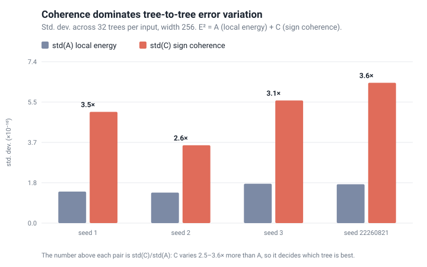

# Error Atlas

> An experiment-driven study of how approximation and finite-precision error is
> defined, propagated, estimated, controlled, and traded off against cost.

## Abstract

Error Atlas investigates a single question across mathematical and computational
objects: how does error enter a computation, how does structure propagate it, and
what can be predicted or controlled before it happens. The main line of work studies
**FP32 rounding error in the summation reduction trees** that form the denominator of
a softmax. Given stored FP32 inputs and an explicit addition tree, an exact rational
oracle reproduces the hardware result bit-for-bit and attributes the final error to
each node, enabling controlled study of how the *shape* of the reduction changes the
error. Confirmatory experiments use preregistered protocols; exploratory diagnostics
are labelled separately, with frozen, versioned evidence. Negative results are
recorded as first-class outcomes, and the headline confirmation has been
independently reproduced from a blank-slate reimplementation.

The current Softmax/reduction-tree research phase closed on 2026-09-07. See the
[closeout](topics/softmax/notes/online_research_closeout_2026-09-07.md) for its findings,
limits, and reproducible evidence; [NEXT_SESSION.md](NEXT_SESSION.md) is the current status entry.

## Headline findings

- **Coherence varies more than local energy across trees in the controlled probes.**
  Writing E² = A + C (local energy plus pairwise cross term), the measured standard
  deviation of C across trees on each fixed input is 2.5–3.6× that of A.
- **The tested magnitude-only Q score omits coherence.** It estimates local energy A
  without modelling C and is outperformed by the beam in the frozen comparison below.
  This does not establish that every magnitude-only selector is ineffective or that Q
  cannot improve on a random tree.
- **A coherence-aware beam narrowly beats the cheap score** on a preregistered,
  frozen synthetic distribution: paired normalized-regret improvement +0.058, 95%
  bootstrap CI [+0.019, +0.098]. The win is genuine but narrow (per-width intervals
  for widths 512 and 1024 cross zero) and its inference cost is not yet cheap enough
  for production; an offline-reuse variant failed its preregistered deployment gate,
  and an online risk certificate reached calibration only.
- **The tested beam trades extra inference cost for a narrow accuracy improvement.**
  These experiments establish neither a general impossibility result for cheap tree
  selection nor production feasibility for the beam. Its cost and the offline-reuse
  no-go motivated the shift from *ranking trees* toward *carrying a risk state*
  alongside a single reduction.



*Across 32 candidate trees on each fixed input, the tree-to-tree spread of the
coherence term C is 2.5-3.6x that of the local energy A. A magnitude-only score sees
only A. Regenerate with `python tools/make_coherence_figure.py`.*

## What makes it rigorous

- **Exact oracle.** An integer/rational (`Fraction`) implementation of round-to-nearest,
  ties-to-even reproduces hardware binary32 addition exactly, including subnormals and
  carry, verified against NumPy float32 over hundreds of thousands of cases.
- **Preregistration and frozen evidence.** Confirmation protocols are frozen before
  execution; post-hoc diagnostics retain their exploratory status. Artifacts are
  versioned CSV/JSON with SHA-256 provenance and
  are never silently overwritten. See the [results index](topics/softmax/experiments/results/README.md).
- **Honest negatives.** Depth-margin screening, energy-beam v1, offline tree reuse, and
  the online certificate are all recorded with their exact evidence grade, including the
  ones that failed.
- **Independent replication.** The confirmed pipeline was re-implemented from a blank
  skeleton and reproduced the frozen headline bit-for-bit, catching four implementation
  bugs and one source-vs-artifact drift along the way. See the
  [replication notes](topics/softmax/notes/rewrite_replication.md).

## Why it matters for systems

The online extension tracks weighted merge residuals in (m, ℓ, O), through the final
scalar output O/ℓ. Ordinary fixed-contribution summation reproduces the main chain
disadvantage in the saved sample. In the final diagnostic, 332 of 384 correlated
nonconstant-V online tree pairs differ in FP32 output; none differ after FP16 or BF16
storage casts. These controlled CPU cases demonstrate no final-storage benefit from
switching trees and do not establish full-attention accuracy or GPU performance.
See the [output report](topics/softmax/notes/online_scalar_output_v1.md).

## Taylor expansion (first topic, complete)

The first topic establishes the shared error vocabulary on a clean object: the Taylor
remainder R_n = f(x) - P_n(x). It works through Lagrange, integral, and Peano remainders;
the difference between actual error, asymptotic order, and a worst-case bound; bound
validity versus tightness; and error propagation through a computation chain. The applied
capstone is numerical differentiation, where truncation error (O(h^2) for a central
difference) trades off against amplified rounding and statistical noise (O(u/h)); a
deterministic budget and a bias-variance model both predict the optimal step, validated
against a reproducible Monte Carlo experiment. The line closes with a closed-book rewrite
of the core, the same replicate-from-scratch discipline later applied to softmax. See
[the topic README](topics/taylor-expansion/README.md).

## Repository guide

| Topic / stage | Status |
| --- | --- |
| [Taylor expansion](topics/taylor-expansion/README.md) | First pass complete: derivations, experiments, closed-book rewrite |
| [Softmax foundations & exact graph oracle](topics/softmax/notes/foundations.md) | First pass complete; early evidence grades preserved |
| Fixed-K8/B3 tree ranking | Confirmed on a controlled distribution; inference cost still high |
| Offline tree reuse | Beats a random fixed tree but fails the balanced-FP32 deployment gate (no-go) |
| Online risk certificate | Calibration complete; statistical signal, no confirmation or deployment claim |
| Online normalizer & scalar output | Closed after exploratory ablation and output diagnostics; no demonstrated low-precision storage benefit in the tested cases |

```text
framework/                 research discipline and the implementation-learning protocol
docs/                      maintenance guide and historical handoffs
tools/                     the single test entry and its own tests
topics/<topic>/
    README.md              topic entry
    notes/                 theory and research notes
    experiments/           source, frozen protocols, results/ evidence, rewrite/ replication
    tests/                 regression tests
```

- [Softmax experiment index](topics/softmax/experiments/README.md) — find code by role.
- [Results index](topics/softmax/experiments/results/README.md) — confirmed results,
  negatives, and calibration observations, each with its evidence boundary.
- [Replication partition](topics/softmax/experiments/reduction_analysis/README.md) and
  the [rewrite package](topics/softmax/experiments/rewrite/README.md) — the independent
  reimplementation and its differential tests.
- [KNOWLEDGE_MAP.md](KNOWLEDGE_MAP.md) — a standalone teaching text; learning material,
  not a source of current research status.
- [NEXT_SESSION.md](NEXT_SESSION.md) — current status and archive entry.

## Reproducing the checks

Requires CPython 3.12+; dependencies in [requirements.txt](requirements.txt).
The full regression and frozen replay suite was verified on Windows with CPython
3.13.12, NumPy 2.4.6, and Matplotlib 3.10.8. Python 3.10/3.11 are not supported for
exact replay: their float `sum()` algorithm differs from 3.12+, which changes frozen
capture values. Other environments must pass the replay checks before claiming exact
agreement; dependency ranges alone do not guarantee it.

```sh
python -m pip install -r requirements.txt
python tools/run_tests.py
python tools/run_tests.py --suite softmax -v
```

The test entry runs regression and replication tests only; it never re-runs the
one-shot experiment CLIs that publish frozen artifacts. Before any intentional
reproduction, read the specific stage's results README and preregistration.

## Method conventions

Fix the reference, metric, assumptions, and error sources first; then study bounds,
propagation, and control. Follow the
[error-analysis protocol](framework/error_analysis_protocol.md) and the
[implementation-learning protocol](framework/implementation_learning_protocol.md):
record predictions before running, preserve raw data and provenance, and separate
implementation, numerical, measurement, and statistical error. Topic registry:
[TOPICS.md](TOPICS.md). Structure and evidence-preservation rules:
[maintenance guide](docs/maintenance.md).
