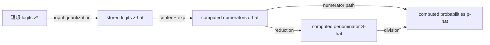

# Softmax

> Active — exact graph oracle established; statistical predictor utility not yet evaluated.

## Current question

研究 logits 的方向性误差怎样经过 Softmax normalization，区分问题条件性、
求值算法稳定性与输入表示误差，并继续连接 finite precision、cross-entropy
与可调精度。

## Research card

- **Object**：多分类 Softmax、log-softmax 与 cross-entropy。
- **Reference**：实数算术下的 Softmax 或 fused cross-entropy。
- **Metric**：stored logit-difference error、概率绝对误差与输出
  $2$-norm。
- **Sources**：输入量化、exp approximation、overflow、underflow、求和、
  除法、舍入顺序与不稳定组合。
- **Propagation**：Jacobian 的零空间、contrast tangent space 与奇异方向；
  exp、求和和除法误差的逐阶段传播。
- **Control**：subtract-max、sign-aware sigmoid、fused loss 与计算 dtype。
- **Optimization**：后续比较 precision、dynamic range 和计算成本。
- **Verification**：精确小例、运行前预测、边界测试、CSV、metadata 与
  closed-book rewrite。

## Established results

对任意类别数，Softmax Jacobian 为

$$
J_s(\mathbf z)
=\operatorname{diag}(\mathbf p)-\mathbf p\mathbf p^T.
$$

它是对称半正定矩阵，并满足

$$
J_s\mathbf1=0,
\qquad
\mathbf v^TJ_s\mathbf v
=\operatorname{Var}_{i\sim p}(v_i)
=\frac12\sum_{i,j}p_ip_j(v_i-v_j)^2.
$$

因此共同平移方向是零空间；其余局部变化发生在概率单纯形的切空间
$\mathbf1^\perp$ 内。Jacobian 是 logits 局部扰动到概率变化的线性地图，
其谱给出方向相关的局部放大倍数。

三分类均匀点 $p=(1/3,1/3,1/3)$ 满足

$$
J_s=\frac13\left(I-\frac13\mathbf1\mathbf1^T\right).
$$

两个正交 contrast directions 的特征值均为 $1/3$，共同平移方向的
特征值为 $0$。在非均匀点 $p=(1/2,1/4,1/4)$，两个 contrast
directions 出现不同增益：

$$
J_s(2,-1,-1)^T=\frac38(2,-1,-1)^T,
\qquad
J_s(0,1,-1)^T=\frac14(0,1,-1)^T.
$$

所以均匀点在 contrast plane 内各向同性，非均匀概率会产生方向性。

二分类 Jacobian 为

$$
J_s(\mathbf z)
=p_1p_2
\begin{pmatrix}
1&-1\\
-1&1
\end{pmatrix}.
$$

共同平移方向 $(1,1)^T/\sqrt2$ 的奇异值为 $0$，contrast direction
$(1,-1)^T/\sqrt2$ 的奇异值为 $2p_1p_2$。因此

$$
\|J_s(\mathbf z)\|_2
=2p_1p_2
\le\frac12.
$$

Binary Softmax 只依赖 $d=z_1-z_2$。对 one-hot cross-entropy，

$$
\nabla_{\mathbf z}L=\mathbf p-\mathbf y,
\qquad
\nabla_{\mathbf z}^2L=J_s(\mathbf z).
$$

对所有类别数都有紧的全局上界

$$
\|J_s(\mathbf z)\|_2\le\frac12.
$$

它给出精确 Softmax 在绝对 $2$-norm 下的全局 Lipschitz 界。这个
$1/2$ 是跨所有概率分布的紧上确界：二分类均衡点可以达到；多分类时可由
概率质量趋向集中在两个类别各一半而逼近。$p=(1/2,1/4,1/4)$ 处的
$3/8$ 则是固定输入点的局部最坏增益。共同平移使任意点都有零增益方向；
即使限制到 contrast directions，概率饱和也说明不存在正的全局下界。
固定点的 Jacobian 只控制局部误差；有限扰动需沿路径积分：

$$
s(\mathbf z+\Delta\mathbf z)-s(\mathbf z)
=\int_0^1J_s(\mathbf z+t\Delta\mathbf z)\Delta\mathbf z\,dt.
$$

subtract-max 利用精确 shift invariance 控制正指数 overflow；fused
cross-entropy 在浮点求值前保留解析抵消。但这些稳定化不能恢复
normalization 之前已经丢失的输入差异。

若 $m=\max_i z_i$，one-hot cross-entropy 的稳定求值形式为

$$
L=(m-z_y)+\log\sum_i e^{z_i-m}.
$$

它避免先生成可能溢出或下溢的概率再计算 $-\log p_y$。

## Finite-precision propagation

在 subtract-max 已完成、没有下溢，并暂时把 shifted logits 视为已给定的
前提下，令

$$
q_i=e^{x_i},
\qquad
\widehat q_i=q_i(1+\epsilon_i),
\qquad
\bar\epsilon=\sum_jp_j\epsilon_j.
$$

精确 normalization 会消掉 exp 相对误差的共同部分：

$$
\frac{\widehat p_i-p_i}{p_i}
=\frac{\epsilon_i-\bar\epsilon}{1+\bar\epsilon}
\approx\epsilon_i-\bar\epsilon.
$$

这是 Jacobian 传播的另一种写法，因为

$$
q_i(1+\epsilon_i)
=\exp\!\left(x_i+\log(1+\epsilon_i)\right).
$$

也就是说，exp 相对误差可解释为一个小的 logits 扰动；共同误差对应
$\mathbf1$ 方向并落入 Jacobian 的零空间。

再加入求和相对误差 $\eta$ 和第 $i$ 次除法误差 $\delta_i$，有

$$
\frac{\widehat p_i}{p_i}
=\frac{(1+\epsilon_i)(1+\delta_i)}
       {(1+\bar\epsilon)(1+\eta)},
$$

一阶误差预算为

$$
\boxed{
\frac{\widehat p_i-p_i}{p_i}
\approx\epsilon_i-\bar\epsilon-\eta+\delta_i
}.
$$

若 $|\epsilon_i|\le\alpha u$，则

$$
|\epsilon_i-\bar\epsilon|
\le2(1-p_i)\alpha u.
$$

普通顺序求和满足

$$
|\eta|\le\gamma_{n-1}
=\frac{(n-1)u}{1-(n-1)u}
\approx(n-1)u,
$$

而平衡树形求和的理论深度把相应量级降为
$O((\log_2n)u)$。顺序、固定平衡树与补偿求和已在受控排列 probe 与
summation stress case 上完成预测—验证（见 Verified summation triage）；
该量级是树深对应的误差界，不保证任意输入上树形结果都优于顺序结果。

概率总量的一阶偏差为

$$
\sum_i\widehat p_i-1
\approx-\eta+\sum_i p_i\delta_i.
$$

因此 exp 差异误差可以在类别间重新分配概率而保持总和为 $1$；求和与
除法误差则可能把结果带离概率单纯形。检查 $\sum_i\widehat p_i=1$
是准确结果的必要条件，但不是充分条件。

上述相对误差模型不覆盖下溢。若数学上的 $q_i>0$ 被计算成 $0$，形式上
$\epsilon_i=-1$，不再是 $O(u)$ 小量；此时绝对误差可能极小，但该分量
相对误差为 $100\%$。是否需要控制它取决于下游 metric 与 consumer。

在这些正常范围假设下，组件误差界还能推出 $O(\alpha u+\gamma+u)$ 的
绝对 normwise forward-error 界。这个结论属于具体求值算法的稳定性；
$\|J_s\|_2\le1/2$ 则属于精确问题的条件性，二者不可混用。

## Fault-to-mitigation ledger

先按求值阶段冻结“实际进入本阶段的值”。这样每个局部 reference 只回答
本阶段新引入了多少误差，不把上游已经发生的输入量化、下溢或近似误差重复
算到本阶段头上。

处置不直接由 failure 名称决定，而按以下顺序收紧：

$$
\text{failure}
\longrightarrow \text{consumer}
\longrightarrow \text{metric}
\longrightarrow \text{tolerance}
\longrightarrow \text{mitigation}.
$$

台账暂时只登记已经完成受控实验的 **Sum** 阶段；其余阶段逐项补入。

| Stage / failure | 冻结的实际输入 | 局部 reference | Metric / tolerance | 通用数值处置 | GPU / implementation-specific audit |
|---|---|---|---|---|---|
| Input / contrast collapse | lossless source logits $z^*$ 与目标存储 dtype | cast 前的 contrasts $d_{ij}^*=z_i^*-z_j^*$，对照 cast 后的 $\widehat d_{ij}=\widehat z_i-\widehat z_j$ | 输入阶段先记录 contrast error。对 argmax，若每个 logit 的绝对存储误差不超过 $\varepsilon_z$，充分条件为 $2\varepsilon_z<m^*$，其中 $m^*$ 是理想 top-two margin。对二分类 probability consumer，最终 metric 是 $\lvert\sigma(\widehat d)-\sigma(d^*)\rvert\le\tau_p$；$\lvert\widehat d-d^*\rvert\le4\tau_p$ 只是全局充分筛查条件 | 在有损 cast 前提高输入精度，或在高精度中先形成 Softmax 所需的 centered logits / contrasts；cast 后再升精度不能恢复已丢差异 | 审计输入 storage dtype、autocast / mixed-precision 边界以及 centering 发生在 cast 前还是后；Tensor Core 或 fused kernel 不能恢复进入 kernel 前已量化的信息 |
| Exp / tail underflow | 实际存储并完成 centering 的 $\widehat x$ | $q_i^{\mathrm{ref}}=\exp(\widehat x_i)$，以及从同一 $\widehat x$ 高精度计算的 consumer reference | 对 target-class NLL，检查 finite status 与 $\lvert\widehat L-L^{\mathrm{ref}}\rvert\le\tau_L$；极小的概率绝对误差不能代表 loss 安全 | subtract-max 控制正指数 overflow；NLL 使用 log-sum-exp / fused algebraic loss。若 consumer 必须显式取得非零 tail probability，则需更宽的 exp 与输出 dtype；renormalization 不能恢复已经变成零的项 | 审计 fast-math exp、flush-to-zero、exp/output dtype 与 kernel 内部算法；FTZ 是硬件/运行模式策略而非 GPU 独有。区分 gradual underflow 与 FTZ 的 probe 应把 $e^{\widehat x_i}$ 放在 subnormal 区间，例如 FP32 的 $\widehat x_i=-90$；$-110$ 在两种模式下都为零，不能辨因。kernel fusion 本身不是稳定性保证 |
| Sum / reduction rounding | exp 阶段实际产出的 $\widehat q$ | $S_q=\sum_i\widehat q_i$，以经过适用域认证的更高精度或精确方法求和 | 先以 nonfinite count 拦截结构性故障；再用有限运行中的 $\max_r\lvert(\widehat S^{(r)}-S_q)/S_q\rvert\le\tau_{\mathrm{sum}}$ 作严格 accuracy 门，容差由 consumer 给出。bit-pattern unique count 单独报告 repeatability，不能替代 accuracy；$\sum_i\widehat p_i-1$ 只能作为下游症状 | 平衡树、补偿求和或更高精度 accumulator；重新归一化只能修正共同缩放，不能恢复上游已丢信息 | 记录 warp/block/cross-block reduction graph、accumulator dtype 与 atomic order；尽量在 CPU 上按同一图逐节点复刻。若复刻得到相同错误，优先归因通用舍入并更换归约方法/精度；只有同图、同 dtype 的复刻仍不能解释差异时，再调查 FTZ、隐式精度、编译器变换等运行时因素。deterministic 只保证可复现，kernel fusion 本身不是稳定性证明 |
| Division / output rounding | 实际计算出的 $\widehat q$ 与 $\widehat S$ | $p_i^{(q,S)}=\widehat q_i/\widehat S$，以更高精度执行 division 并冻结全部上游误差 | 共同相对误差可由 mass residual 发现；differential error 用 classwise error、$L_1$/TV 或 consumer-specific ratio/loss。总质量等于 $1$ 仍可能漏检概率重分配 | 提高 division、reciprocal-multiply 和 output-storage 精度。renormalization 可消去共同缩放，但不能修复不同 $\delta_i$ 已经改变的概率比；提高 denominator accumulator 对纯 division error 无效 | 审计 approximate reciprocal / fast divide、各 lane 的乘法舍入、最终 output cast 与实际 compute dtype；一次 reciprocal 的误差可能近似共同，而逐项乘法和存储舍入仍可产生 differential error |

任何 corrective transform 都要保留处置前后的观测。对 renormalization，处置前的
mass residual 保存原始故障症状；处置后的 mass residual 只验证归一化约束已恢复。
另记录 $\lVert p^{\mathrm{post}}-p^{\mathrm{pre}}\rVert_1$ 量化处置幅度，并用
处置后的 consumer metric 判断结果是否真正可接受。不能把 post-renormalization
的总和为 $1$ 当作准确性证明。

repeatability 与 accuracy 也要分开。固定输入的 dtype、shape、ordered bytes
及其 hash 后，多次记录 $\widehat S^{(r)}$ 的 bit pattern、unique count、
ULP spread 和相对 $S_q$ 的误差。所有运行 bitwise 相同只说明当前执行环境下
结果可复现；若它们共同偏离 reference，仍然是 deterministic bias。

## Verified experiment

固定

$$
\mathbf z(M)=(M+1,M),
\qquad
p_1^{\mathrm{ref}}=\sigma(1).
$$

先把 logits 存为 FP32，再执行 subtract-max。实验得到

$$
M=2^{23}
\Rightarrow
\widehat d=1,\quad
\widehat p_1\approx0.7310586,
$$

$$
M=2^{24}
\Rightarrow
\widehat d=0,\quad
\widehat p_1=0.5.
$$

误差发生在 input quantization，而不是 stable normalization。量化与
中心化一般不交换：

$$
Q\!\left(\mathbf z-m\mathbf1\right)
\ne
Q(\mathbf z)-\max(Q(\mathbf z))\mathbf1.
$$

实验预测、实测表、边界、源码、测试、CSV、metadata 与 closed-book
evidence 统一保存在 experiments 目录。

### Verified summation triage

当前 runner 直接冻结 reduction 的实际 FP32 输入，以 exact `Fraction`
区分 requested source sum 与 stored-input sum，并在 binary64 中间值能被精确
表示时才进行一次 FP32 correctly-rounded target 转换。证据按

$$
\text{case reference}\to\text{raw observation}\to
\text{policy-free summary}\to\text{policy assessment}
$$

分离输入/reference、事实、聚合指标和判定。suite v3 的 smoke registry 包含：

- power-tail 的 $(N,e)=(1,-24),(2,-24),(1024,-24)$；
- 围绕 $1+2^{-24}$ midpoint 的放大边界族
  $(N,e)=(1023,-34),(1024,-34),(1025,-34)$；
- 非二进制友好的 decimal-tail $(N,t)=(5,10^{-8}),(6,10^{-8})$；
- 每组参数的 head-first / tail-first 两种 layout。

共 16 个 smoke cases。每个 case 运行 sequential FP32、固定 pairwise FP32、
Kahan FP32 和 FP64 accumulator 四个 candidates，默认重复三次，再分别应用
consumer tolerance 与 correct-rounding 两个 policy；对应 16 case rows、
192 raw rows、64 policy-free summary rows 和 128 assessment rows。

midpoint 边界族的 target 为：

| $(N,e)$ | Position | Correct FP32 target |
|---|---|---|
| $(1023,-34)$ | below midpoint | `0x3f800000` |
| $(1024,-34)$ | exact tie, ties-to-even | `0x3f800000` |
| $(1025,-34)$ | minimally above midpoint | `0x3f800001` |

在 $(1025,-34)$ 上，sequential FP32 仅 head-first 错一位；当前固定 pairwise
tree 在两个 layout 都返回 `0x3f800000`；Kahan FP32 与 FP64 accumulator 在
两个 layout 都命中 target。decimal-tail 的 $N=5$ 是下侧负对照；$N=6$
的 target 为 `0x3f800001`，错误的一 ULP 输出仍可通过 $10^{-6}$ tolerance，
但会失败 correct-rounding policy。

原有 $2^{20}$ power-tail stress tier 仍为 opt-in。容差为 $10^{-6}$ 且要求
bitwise repeatability 时得到：

| Candidate | $\widehat S$ | 最大绝对相对误差 | Decision |
|---|---:|---:|---|
| sequential FP32 | $1$ | $1/17$ | fail: `accuracy_tolerance_exceeded` |
| pairwise FP32 | $17/16$ | $0$ | pass |
| compensated FP32 | $17/16$ | $0$ | pass |
| sequential FP64 accumulator, FP32 output | $17/16$ | $0$ | pass |

三种处置在已注册 case 上均具数值资格，但不能由 Python 原型耗时推断 GPU
性能排序；目标硬件上的 latency、throughput、workspace、occupancy 与实际
reduction graph 仍需单独测量。

当前源码与测试已经定义 suite v3 / artifact schema v2，但仓库中的
`results/failure_triage/` 仍是 2026-08-08 的旧 artifact snapshot，本轮未
覆盖。expanded artifact 必须先写入新的 scratch directory 并审查，之后才可
有意替换已登记证据。

### Graph-only predictor：accepted scope and evidence status

对 ordered stored FP32 leaves 和一张显式二叉加法树 $G$，定义每个内部节点

$$
a_v=y_{\ell(v)}+y_{r(v)},
\qquad
y_v=\operatorname{RN}_{32}(a_v),
\qquad
\rho_v=y_v-a_v.
$$

记实际进入 reduction 的 exact leaf sum 为

$$
S_{\mathrm{leaf}}=\sum_i x_i,
$$

而不是笼统称为 `reference`。量化前的 source sum、stage-local exact leaf sum
与 correctly-rounded target
$\operatorname{RN}_{32}(S_{\mathrm{leaf}})$ 必须分开。运行前 signed
forward-error predictor 为精确恒等式

$$
\boxed{
E_G(x)=y_{\mathrm{root}}-\sum_i x_i=\sum_{v\in G}\rho_v
}.
$$

predictor 使用 `Fraction` 和整数 ties-to-even，不调用 NumPy 浮点加法，也不
读取 candidate 输出。`prediction_matched_observation` 只检查 predictor 是否
描述了 candidate 的实际行为；`candidate_correctly_rounded` 则检查 candidate
是否命中 $\operatorname{RN}_{32}(S_{\mathrm{leaf}})$。predictor 可以准确命中
一个 incorrect candidate output，因此这两个判断不能合并成单一 `pass`。
当前 predictor batch CSV 只版本化前一个判断；其中
`preregistered_sum_bits` 是预登记的 graph output，不是 correctly-rounded
target。correct-rounding assessment 若进入后续 artifact，必须增加独立 target
与独立字段，不能从名称相似的列中推断。

本轮重新按小台阶审查后，accepted scope 为：

| Step | Accepted content | Evidence |
|---|---|---|
| P0 | $S_{\mathrm{leaf}}$、显式 proper addition tree、$E_G=\sum_v\rho_v$、证伪条件与适用域 | 代数展开与 boundary audit |
| P1 | normal midpoint 的 odd/even tie、subnormal tie、subnormal/normal 接缝、binade carry 与有限域拒绝 | 4 个定向 `ExactFP32RoundingTests` |
| P2 | $N=9,e=-27$ 的 tail-first minimal graph discriminator，以及同 multiset 的 head-first layout control | batch CSV 中 4 行 |
| P3 | 固定 $e=-27$ 的 $N=7/8/9$ tail-first boundary triple；$N=129,e=-31$ 与 $N=2049,e=-35$ 的 above-midpoint scale replication | batch CSV 中 8 行 |
| P4 | 预先冻结 $x=(4u,2u,2u,u,1)$、$u=2^{-27}$，再各执行一次 sequential / fixed-pairwise | 独立 preregistration、2 行 observation CSV 与 metadata |
| P5 negative result | depth-margin baseline 的 universal ordering 在 $S_{\mathrm{leaf}},M,D_G,R_G$ 全相同、只改变 sibling grouping 的 pair 上被推翻；不是 predictor-validation 最终里程碑 | adversarial preregistration、2 行 exact-oracle CSV 与 metadata；未执行 candidate |

因此正式接受的是 batch CSV 中 12 行 graph observations。selector 为：

- `k=3`、`tail_then_head`、`N in {7,8,9}`、两张图；
- `k=3`、`head_then_tail`、`N=9`、两张图；
- `(k,N)=(7,129),(11,2049)`、`tail_then_head`、两张图。

已有 scaled-midpoint CSV 的 36/36 prediction matches 仍是有效 raw
observation，但其中超出上述 selector 的 24 行属于 **provisional batch
replication**，不再作为一次完成的研究台阶。两组非均匀正输入排列只完成了
interactive pilot；它们尚未进入版本化 artifact，也不能被追溯性地称为
pre-execution preregistration。

随后选择了一个不同的新 case
$x=(4u,2u,2u,u,1)$、$u=2^{-27}$。preregistration 在执行前冻结并取得 SHA-256
`0c8047f38363c02ef6a6995bcc58a3f890dfebe7395aa5eb62a5cb671d6e47a6`。
single-case observation 中，sequential 命中 `0x3f800001` 与 $E_G=+7u$，
correct-rounding pass；fixed-pairwise 命中 `0x3f800000` 与 $E_G=-9u$，
correct-rounding fail。两个 graph prediction 均命中 actual。该结论只接受为
一个 nonuniform positive case，不外推为 family result。每张图只执行一次，
因此 repeatability 明确为 not measured；single observation 可以证伪 prediction，
但不能建立 bitwise repeatability。

repeatability 的 raw runs、bit counts、summary 与 policy assessment 已由
failure-triage pipeline 定义。若 consumer 后续要求该属性，应复用那条管线，
不为 predictor case 复制一套 ad hoc repeat runner。未来 regression test 即使
再次调用 candidate，也不会自动成为版本化 repeatability evidence。

P5 另行考察便宜的 screening proxy

$$
R_G=\frac{\varepsilon_{32}\sum_i d_i|x_i|}{M}.
$$

最初只移动 unit head 深度的未执行 preregistration 在看 oracle 前即降级为
known-mechanism calibration，因为它重复了已经知道的 head-depth effect。随后
冻结 topology challenge
$x=(1,32q,q/2,q/2)$、$q=2^{-29}$：两张满二叉树具有相同的
$S_{\mathrm{leaf}}=1+33q$、$M=q$、leaf depths、$D_G$ 与 $R_G$，只改变
sibling grouping。独立 proxy 计算确认两者
$R_G=536870945/8388608$；exact semantic oracle 随后确认一个 graph
$F_G=1,E_G=-33q$，另一个 $F_G=0,E_G=+31q$。这是 `tied informative pair`，
因此推翻“每个 informative pair 都满足
$R_{\mathrm{failure}}>R_{\mathrm{correct}}$”的强命题。

该反例只说明 depth 与 boundary margin 丢失了 sibling grouping / rounding
phase 信息；它不是 population ranking estimate，也不推翻 exact graph oracle。
本步没有执行 NumPy candidate，不声称 candidate conformance 或 repeatability。

accepted 结论只覆盖已知的非负、finite、无 overflow、每个 binary addition
恰有一次 FP32 RN-even 舍入的 proper tree。匹配只能说明 candidate 与所声明的
graph contract 在已审查 cases 上一致，不能唯一识别未知 black-box graph，也
不能建立 sequential / pairwise 的普遍精度排序。尚不覆盖 Kahan、负数
cancellation、FMA 或 GPU。该实现定位为 agent-authored exact semantic oracle
和后续实验的 label generator，不是便宜的工程 predictor；不
声称 learner closed-book mastery。

## Research workflow

本 topic 不复制 Taylor 的线性学习笔记结构，只复用同一研究纪律：

- framework/error_analysis_protocol.md 规定研究循环与 evidence level；
- framework/implementation_learning_protocol.md 规定主动输出和代码
  ownership；
- 运行前记录 direction、scale、boundary 与 failure signature；
- 运行后区分理论、实现、浮点和输入量化误差；
- 结论必须能回到测试与版本化 artifact。

## Current status

- 二分类与三分类方向性、切空间、局部谱和全局 $1/2$ 界已收口；
- exp、求和、除法的一阶误差预算及其适用边界已完成；
- 已区分问题条件性、求值算法稳定性和输入表示误差；
- 稳定求值和首个 FP32 输入量化实验已收口；
- 原实现与 closed-book rewrite 在三个注册 probe 上完全一致；
- “故障—consumer—metric—tolerance—处置”决策链与首个求和 stress
  artifact 已收口；当前代码进一步把 case reference、raw、policy-free
  summary 与 policy assessment 拆成四层，并加入 canonical policy identity；
- 顺序、固定平衡树与补偿求和已在受控排列 probe 上完成预测—验证；
  $O((\log n)u)$ 是树深对应的误差量级界，不保证任意输入上的树形结果
  都优于顺序结果；
- 已加入小规模 tie、decimal midpoint 两侧和放大后的
  below/tie/minimal-above 三点边界族；failure-triage artifacts 尚未覆盖旧
  snapshot；
- 已接受只依赖 stored input、显式二叉 reduction tree 与 RN-even 的 exact
  semantic oracle $E_G$，以及逐项审查的 12 行 graph observations；完整 36 行
  scaled-midpoint artifact 降为 provisional batch replication，非均匀输入仍为
  两组 unversioned interactive pilots；另有一个不同的 preregistered
  nonuniform positive case 已产生 2 行 accepted observations。2026-08-12
  状态审计报告完整 Softmax suite 为 93 项通过；本次文档纠偏没有再次运行测试。
  P4 repeatability 未测量，若需要则复用 failure-triage pipeline；
- depth-margin cheap screening baseline 的 universal matched-pair ordering 已被
  一个预注册、只改变 sibling grouping 的 tied informative pair 推翻；该结果
  使用 exact oracle、未执行 candidate，也不提供 population-level ranking rate；
  因而 cheap score 的 Spearman、AUROC 或实际筛查能力仍完全未测量；
- GPU 阶段暂停在实现前：先学习异步执行、thread/block/warp、memory
  hierarchy、reduction mapping 与可信计时，再远程测量。仅凭库调用的结果和
  latency 不能声称内部 reduction graph；
- entropy/Fisher/KL 博客链和 Taylor-approximated exp 权衡暂列 TODO。
